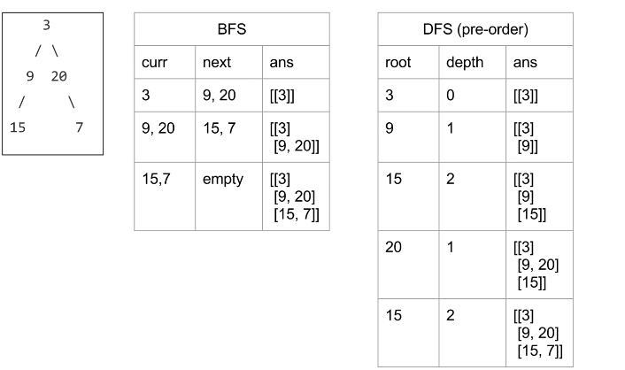

```
- 2020-11-11
```

参考
- [花花酱 LeetCode 102. Binary Tree Level Order Traversal](http://zxi.mytechroad.com/blog/leetcode/leetcode-102-binary-tree-level-order-traversal/)


题目出处

- [102. Binary Tree Level Order Traversal](https://leetcode-cn.com/problems/binary-tree-level-order-traversal/)
  - [637. Average of Levels in Binary Tree](https://leetcode-cn.com/problems/average-of-levels-in-binary-tree/)

- [剑指 Offer 32 - II. 从上到下打印二叉树 II](https://leetcode-cn.com/problems/cong-shang-dao-xia-da-yin-er-cha-shu-ii-lcof/)

Given a binary tree, return the level order traversal of its nodes' values. (ie, from left to right, level by level).

# Example

Given binary tree `[3,9,20,null,null,15,7]`,

```
    3
   / \
  9  20
    /  \
   15   7
```

return its level order traversal as:

```
[
  [3],
  [9,20],
  [15,7]
]
```

# 分析和Code

按照节点高度,从左至右输出节点,即层次遍历



DFS

- `depth`:树的层次的标号
- 遍历时,左子树优于右子树

## DFS

```C++
/**
 * @file BFS.cpp
 * @author huahua
 * @brief 102. Binary Tree Level Order Traversal
 * @version 0.1
 * @date 2020-11-11
 * 
 * @copyright Copyright (c) 2020
 */

#include<vector>

using std::vector;

struct TreeNode {
    int val;
    TreeNode *left;
    TreeNode *right;
    TreeNode(int x) : val(x), left(NULL), right(NULL) {}
};

class Solution {
public:
    vector<vector<int>> levelOrder(TreeNode* root) {
		if(root == nullptr)
            return {};
        
        vector<vector<int>> ans;
        vector<TreeNode*> curr, next;

        curr.push_back(root);

        // process every level an by one
        while(!curr.empty()){
            ans.push_back({});
            for(const auto& node : curr){
                ans.back().push_back(node->val); // 取末尾数组,然后加进去

                if(node->left)
                    next.push_back(node->left);
                if(node->right)
                    next.push_back(node->right);
            }
            
            // swap(curr, next);
            // movable
            curr.swap(next); 
            next.clear();
        }

        return ans;
    }
};
```

## BFS

```C++
/**
 * @file DFS.cpp
 * @author huahua
 * @brief 102. Binary Tree Level Order Traversal
 * @version 0.1
 * @date 2020-11-11
 *
 * @copyright Copyright (c) 2020
 */

#include <vector>

using std::vector;

struct TreeNode {
  int val;
  TreeNode *left;
  TreeNode *right;
  TreeNode(int x) : val(x), left(NULL), right(NULL) {}
};

class Solution {
public:
  vector<vector<int>> levelOrder(TreeNode *root) {
    if (root == nullptr)
      return {};

    vector<vector<int>> ans;

    DFS(root, 0, ans);

    return ans;
  }

private:
  /**
   * @brief 
   * 
   * @param root 
   * @param depth 
   * @param ans 
   */
  void DFS(TreeNode *root, int depth, vector<vector<int>> &ans) {
    if (root == nullptr)
      return;

    // Works with pre/in/post order
    // 当前数组还未存储当前树层的数据,先创建空数据,用来站位
    while (ans.size() <= depth){
        ans.push_back({});
        
        DFS(root->left, depth + 1, ans);
        DFS(root->left, depth + 1, ans);
        ans[depth].push_back(root->val);
    }      
  }
};
```

## 对比DFS和BFS

DFS

- 需要考虑少,更易实现

> 深度受限搜索