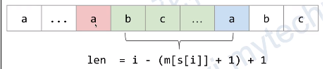
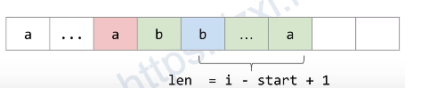
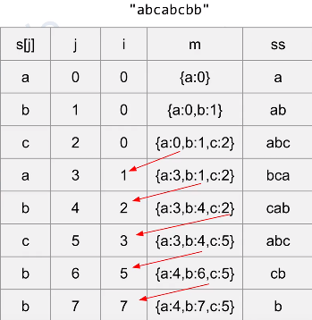

[3. 无重复字符的最长子串](https://leetcode-cn.com/problems/longest-substring-without-repeating-characters/)

- liuyubobobo
- [花花酱 LeetCode 3](https://zxi.mytechroad.com/blog/string/leetcode-3-longest-substring-without-repeating-characters)

给定一个字符串，请你找出其中不含有重复字符的 **最长子串** 的长度。

# 示例

示例 1:
```
输入: s = "abcabcbb"
输出: 3 
解释: 因为无重复字符的最长子串是 "abc"，所以其长度为 3。
```
示例 2:
```
输入: s = "bbbbb"
输出: 1
解释: 因为无重复字符的最长子串是 "b"，所以其长度为 1。
```
示例 3:
```
输入: s = "pwwkew"
输出: 3
解释: 因为无重复字符的最长子串是 "wke"，所以其长度为 3。
     请注意，你的答案必须是 子串 的长度，"pwke" 是一个子序列，不是子串。
```
示例 4:
```
输入: s = ""
输出: 0
```
# 说明

- $0 <= s.length <= 5 * 10^4$
- `s` 由英文字母、数字、符号和空格组成

# 实现

## 暴力法(Brute Force):$O(n^3)$

- 子串共有$n^2$个
  - $O(n^2)$
  - 使用`hashtable/array`
- 查找重复字符
  - $O(n)$

## 优化暴力法:$O(n^2)$

```C++
class Solution {
public:
    int lengthOfLongestSubstring(string s) {
        const int n = s.length();
        int ans = 0;
        
        // [i, ..., j) 
        for(int i = 0; i < n; ++i){ // O(n)
            vector<int> seen(128); // 存储/计数是否被访问过
            int j = i;
            // j < n 没有扫描完毕
            // seen[s[j]] 为0,则未被访问过,即s[j]不是重复字符
            // while(j < n && !seen[s[j]]++)
            while(j < n && !seen[s[j]]){  // O(128)
                seen[s[j]]++; // 将已扫描的字符标记
                j++; // 准备扫描下一个字符
            }

            ans = max(ans, j-i); // [i, ..., j) 
        }

        return ans;
    }
};
```

## 双指针/滑动窗口

两种方法的`HashTable`的索引的含义不同

### liuyubobobo

对于子串`s[i, ..., j]`,判断字符`s[j++]`是否与`s[i, ..., j]`有重复字符
- 若没有重复字符,`s[j++]`并入子串`s[i, ..., j]`
- 若有重复字符,记录当前子串的长度,与记录的长度比较
  - `i++`移动到重复字符的后面的位置,将`s[j++]`并入子串`s[i, ..., j]`,形成新的子串

如何判断重复字符
- 用一个大小为`256`的数组`freq[256]`,来存储字符出现的频率,下标表示`ASCII`

```C++
class Solution {
   public:
    int lengthOfLongestSubstring(string s) {
        // 用于记录字符是否在子串中
        int freq[256] = {0};

        int l = 0, r = -1;  //滑动窗口为s[l...r]
        int res = 0;

        while (r + 1 < s.size()) {
            if (freq[s[r + 1]] == 0){ // s[r + 1]不在子串中
                r++; // 向右移动
                freq[s[r]]++; // 标记字符位于子串中
            }
            else {   // s[r + 1]在子串中
                freq[s[l]]--;
                l++;
            }

            res = max(res, r - l + 1);
        }

        return res;
    }
};
```


### huahua

>  huahua的方法未理解

- `(i,j)`:移动`j`,在$O(1)$确定`i`
  >  `m[s[j]]`:`s[j]`上一次出现的位置

  - 情况1:`len = i - (m([s[i]] + 1) + 1)`
    
  - ==情况2(未理解)==:`len = i - start + 1`
    
  - `i = max(i, m[s[j]] + 1)`
    - 若`i = i`,说明是情况1
    - 若`i = m[s[j]] + 1)`,说明是情况2


- 举例


```C++
// Author: Huahua
class Solution {
   public:
    int lengthOfLongestSubstring(string s) {
        const int n = s.length();
        int ans = 0;
        // 初始化为位置'-1'
        // 记录字符最后一次出现的位置
        vector<int> idx(128, -1); 
        
        // i记录左端点, j记录右端点
        for (int i = 0, j = 0; j < n; ++j) {
            i = max(i, idx[s[j]] + 1); // idx[s[j]]:s[j]上一次出现的位置
            ans = max(ans, j - i + 1);
            idx[s[j]] = j; // 更新位置;不用判断是否在HashTable中
        }
        
        return ans;
    }
};
```
