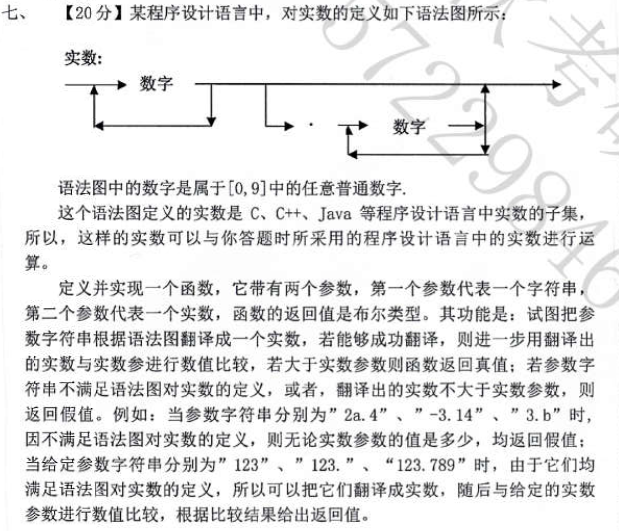

# 线性表

## 综合

### [2013 软专]

- 对于单链表,双向链表,单向循环链表
  - 仅知道`p`指向某`node`,不知道头指针,能否将`p`从链表中删除.若可以,其时间复杂度为多少?

## 单链表

### 简答题

#### [2017 计学-941/2015 计专/2012 计学-488]

- 链表插入/查找/删除的时间复杂度

2015 计专

- 若某线性表最常用得操作是存取任一指定序号的元素和在最后进行插入和删除运算，则利用哪种存储方式最节省时间？
  - [参考](https://www.nowcoder.com/questionTerminal/adffc32edf3f4dc48eba48f78d70d635?from=14pdf)

#### [2012]
- 分析链式存储与顺序存储的优缺点

### 算法设计题

#### 合并: [2020 计专/2018 软专/2017 计专/2002]

2020 计专

- 链表合并

链表合并
- 要求
  - 去除重复`node`
- 有序链表的合并
  -  [剑指 Offer 25. 合并两个排序的链表](https://leetcode-cn.com/problems/he-bing-liang-ge-pai-xu-de-lian-biao-lcof/)
  - [21. 合并两个有序链表](https://leetcode-cn.com/problems/merge-two-sorted-lists/)
- 无序链表合并,然后去除重复`node`
- [两个链表的合并，去除重复`node`](https://blog.csdn.net/a375809600/article/details/84494960)
> 有疑问,原题说链表存储的是集合,但是集合是无序的,可给的例子又是有序链表的合并

2018 软专 
- 两个升序单链表合并为一个降序单链表
- 不借助额外空间

2017 计专

- 实现两个链表所代表合集的并集

2002

- 两个表示八进制的链表相加
    - [面试题 02.05. 链表求和](https://leetcode-cn.com/problems/sum-lists-lcci/)

#### 插入,交换,删除: [2020 软学/2020 计专/2019 计专-966/2017 软/2017 计专/2013 计-966/2012 计学-488/2001]

2020 软学
- 在链表中找data域为k的元素,若找到,则将其与尾`node`互换位置

2018 软学
- 在链表中找data域为k的元素,若找到,则将其前驱的`node`交换位置

2013 计-966
- 带有头`node`的指针`head`的链表
- 删除一个值最大的`node`,并将该`node`的值存入头`node`的值域中

2020 计专/2017 计专

- 删除链表中的重复`node`

2019 计专-966
- 删除指定`node`的值

2012 计学-488

- 找到链表中值域最小的节点,放在链表的最前面

#### [2017 计专/2002]

- 将`x`插入元素递增的顺序表,保持该表的有序性
  - 递归/非递归
  - [148. 排序链表](https://leetcode-cn.com/problems/sort-list/)

#### [2016 计学-941/2012 计-966]

- [剑指 Offer 22. 链表中倒数第k个`node`](https://leetcode-cn.com/problems/lian-biao-zhong-dao-shu-di-kge-jie-dian-lcof/)

#### [2016 计专]

- 编写一段代码, 对给定的由整型元素`node`构成的链表`L`,进行插入`node`操作， 
  - 方案是: 任意两个相邻`node`之间插入一个新`node`， 新`node`中的元素值是两个相邻`node`中的元素值之和。  
  - 说明
    - 简要说明你所采用的程序设计语言如何表示链表
    - 假设`L`中的有效`node`个数大于
    - 只针对`L`中原有`node`进行插入`node`操作  

#### [2015 计学-941]

- [面试题 02.07. 链表相交](https://leetcode-cn.com/problems/intersection-of-two-linked-lists-lcci/)

#### [2015 计专]

- 首先，定义一个由整数`node`构成的单向链表的`node`类型，简要说明如何利用该`node`类型表示一个单向链表；其次，定义并实现一个函数，该函数以一个由整数`node`构成的单向链表L为参数，返回一个新的单向链表，新的单向链表由L中删除所有绝对值为素数的`node`后剩余`node`构成，并且，各`node`中的整数值从链头至链尾按不增顺序排列。

#### [2013 计学-941]

- 链表存储多项式的求导
  - [PAT B 1010 一元多项式求导](https://learnku.com/articles/38829)

## 双向链表

### 算法设计题

#### [2020 计学/2019 计学]

- 试设计一个算法，改造一个带表头`node`的双向链表，所有`node`的原有次序保持在各个`node`的`rLink`域中，并利用`lLink`域把所有`node`按照其值从小到大(或从大到小)的顺序连接起来
  - [参考](https://blog.csdn.net/sinat_42483341/article/details/109356654)

#### [2019 软专]

- 设以带头`node`的双向循环链表表示的线性表`L= (a1,a2,…,an)`,试写一时间复杂度`O(n)`的算法，将`L`改造为` (a1,a3,…,an,…,a4,a2)`
  - [参考](https://blog.csdn.net/a81895898/article/details/6941358)

#### [2017 软专/2017 软学-979]

- 设有一个带表头`node`的双向循环链表`L`,每个`node`有`4`个数据成员：指向先驱`node`的指针`prior`、指向后继`node`的指针`next`、存放数据的成员data和访问频度`freq`。所有`node`的`freq`初始时都为`0`.每当在链表上进行一次`L.Locate（x）`操纵时，令元素值x的`node`的访问频度f`req`加`1`，并将该`node`前移，链接到现它的访问频度相等的`node`后面，使得链表中所有`node`保持按访问频度递减的顺序排列，以使频繁访问的`node`总是靠近表头
  - [参考](https://www.nowcoder.com/questionTerminal/46d13cc15bde4b948c562c9bef88d7d6?toCommentId=407110)

# 栈,队列和数组

## 栈

### 简答题

#### [2018 软专/2008 软专]
- 堆栈的定义
- 堆栈的应用

#### 出栈顺序 [2020 软学/2020 计学/2019 计学/2018 软学/2018 计学-941/2016 计专/2016 计学-941/2016 软专-967/2015 软专/2015 计学-941/2014 软专/2014 计学-941/2013计学-9412012 计学-488//2011 软专]

2018 软学
- 若一个栈的输入序列为`1,2,3,…,m-1.m`，输出序列的第`1`个元素是`m`,则第`j`个输出元素是什么
- 分析:
  - 第一个输出的是`m`,说所有元素都在站内
  - 要满足后面输出序列是降序
  - `m-0, m-1, m-2,..., m-(j-1), 2, 1`

2018 计学-941
- 判断一个栈的出栈序列的合法性

2016 计专
- 设栈S和队列Q的初始状态为空, 元素`A,B,C,D，E,F`依次通过栈S，一个元素出栈后即进入队列Q，若6个元素出队的顺序是`B,D,C,F,E,A`则栈S的容量至少应该是多少
  - [参考](https://www.nowcoder.com/questionTerminal/d2fc0b0916f54f779eaa8376d3a23bee)

2016 计专/2014 计学-941/2013计学-941/2012 计学-488

- 给出顺序栈元素进栈顺序,出栈顺序,判断
  - 栈的容量
  - 各元素出栈的情况

2015 软专/2014 软专

- 顺序入栈,出栈序列有多少种
- 判断是否是出栈序列

[946. 验证栈序列](https://leetcode-cn.com/problems/validate-stack-sequences/)

#### [2020 软学/2019 软专/2019 软学/2017 软专/2016 计专/2012 软专/2012 计-966/2009]

- 中缀表达式转换为后缀表达式
- 后缀表达式转换为中缀表达式

2019 软学

- 中缀变后缀,栈的变化

#### [2017 软专/2017 软]

- 画出后缀表达式对应的二叉树表达式,然后写出中缀表达式
- 给出后缀表达式画出中缀表达式

## 队列

### 简答题

#### [2018 软专]

- 队列的定义
- 队列的应用

### 算法设计题

#### [2018 软专]
- 一个长度为n的非负整数双向队列的加权和的最大值
  - 暂时未找到相关题目

## 数组

### 简答题

#### [2019 计专-966/2018 软学/2016 软专-967/2012 计-966]

2018 软学
- 稀疏矩阵转置

2019 计专-966/2012 计-966
- 稀疏矩阵的三元组表示
- 十字链表示

#### 数组地址的计算 [2019 计学/2019 计专-966/2018 计学-941/2017 计学-941/2016 计专/2016 计学-941/2015 计专/2014 计专/2013 软专/2013 计-966/2013计学-941]

2018 计学-941

- 对角矩阵存入一维数组的下标公式

2016 计专/2013 计-966
- 数组`A[8, 10]`中，每个元素的长度为3个字节，行下标`i`从1到8，列下标`j`从1到10，从首地址`SA`开始连续存放在存储器内，该数组按行存放时，元素`A[8][5]`的起始地址为
  - [参考](https://www.nowcoder.com/questionTerminal/136af2637e0949eda52f328d2311f5df)

2015 计专
- 假设以行序为主序存储二维数组`A=array[100][100]`，设每个数据元素占2个存储单元，基地址`A[0][0]`为`10`，则`A[5，5]`的地址为
  - [参考](https://www.nowcoder.com/questionTerminal/bc7a3071081e44bcbfb9867000f54166)

2018 计学-941/2014 计专

- 已知四维数组A`[0:2,0:4,0:10,0:2]`，分别给出按行优先和按列优先存储下的`A[i][j][k][l]`地址计算公式 。
  - [参考](https://www.nowcoder.com/questionTerminal/228106f1e94b4b41b49a333fd3dca85b?toCommentId=1659755)

2013 软专
- 对于四维数组按照列优先,行优先的存储顺序

### 算法设计题

#### [2020 计学]

-  [915. 分割数组](https://leetcode-cn.com/problems/partition-array-into-disjoint-intervals/)

#### [2020 软专/2018 计专/2017 计专/2014 计学-941/2014 软专/2010 软专/2008 软专]

2020 软专/2018 计专/2017 计专/2015 计专
- 将数组里的负数排在数组的前面，正数排在数组的后面。但不改变原先负数和正数的排列顺序。
  - `input: -5，2，-3, 4，-8，-9, 1, 3，-10`
  - `output: -5, -3, -8, -9, -10, 2, 4, 1, 3`

- 时间复杂度为$O(n)$
- 分析算法在最好,最坏以及平均情况下关键词比较次数和记录移动次数

2010 软专
- 将数组中的`0`元素放在数组后面,非`0`元素放在后面,不改变非`0`元素的相对顺序

2014 软专/2014 计学-941/2008 软专

- 将数组里的奇数排在数组的前面，偶数排在数组的后面。

#### [2020 软专]   

- 找出二维数组中加起来最大的那行,然后把这行删除,要求不破坏二维数组原有结构和顺序

#### [2019 软专]

- 统计数组中元素出现的个数
  - [参考](https://leetcode-cn.com/problems/first-unique-character-in-a-string/solution/zi-fu-chuan-zhong-de-di-yi-ge-wei-yi-zi-fu-yong-ch/)

#### [2019计专-966]

- 判断`A[n]`中是否存在`A[i]`为前`i`项的和

#### [2017 软专]

- 二维数组:若某元素小于等于0,则将其所在行和列上的所有元素置为0,然后输出
  - [清除行列](https://www.nowcoder.com/questionTerminal/c95aac1506574dfc8ad44c3939c6739d)

#### [2017 计学-941/2003]

- `A`和`B`是长度为`n`的两个数组。设计一个算法，该算法输出长度为`n`的数组`C`，要求
  -  数组`C`中的每一个元素$C[i] = ||{A[j]| A[j]≤B[i]，1≤j≤n}||$， 其中$||S||$表示集合`S`中的元素个数。
     -  例如：下表给出了长度为`4`的两个数组A和B，以及满足要求的数组`C`；
  
  - 算法复杂度低于$O(n^2)$

#### [2016 软专-967]

- 数组存储的二进制加`1`
  -  [66. 加一](https://leetcode-cn.com/problems/plus-one/)
  -  [67. 二进制求和](https://leetcode-cn.com/problems/add-binary/)
  -  [1073. 负二进制数相加](https://leetcode-cn.com/problems/adding-two-negabinary-numbers/)

#### [2016 计专]

- 在`M×N`的二维数组`A`中 ,已经存放了`M×N`个整型元素,其中`M`和`N`均是大于`1`的常量.
- 编写一段代码,用来对`A`中的元素按元素数值大小进行排序.
- 排序的规则是
  - 数组`A`的每一行的元素,均按升序排列
  - 当`i`大于`1`时,数组`A`的任意第`i`行中的任意元素值,均不小于第`i-1`行中的任意元素值

#### [2015 计专]

- 通常用二维数组表示矩阵，编写一个完成程序，在该程序中，定义一个20行10列的二维整形数组，通过键盘输入数据至该数组，输出该数组所对应矩阵的四周边缘元素的平均值。

#### [2014 软专]

- 数字存入数组,两个数组相乘,结果存入数组
  -  [43. 字符串相乘](https://leetcode-cn.com/problems/multiply-strings/)

#### [2014 计学/2008 计]

- [剑指 Offer 21. 调整数组顺序使奇数位于偶数前面](https://leetcode-cn.com/problems/diao-zheng-shu-zu-shun-xu-shi-qi-shu-wei-yu-ou-shu-qian-mian-lcof/)

#### [2014 计专]

- 已知一维数组A中已经存放了200个整数，编写代码段，其功能是输出该数组中所有不同的数据值及其在该数组中各自出现的次数，即：对数组中不同的数据各自出现的频率进行统计并输出。题意举例，对于只有10个元素的数组，若存放的数组如下
- `3, 5, 3, 3, 10, 7, 7, 5, 3, 7`
- 则程序应该能够输出
  - 3  出现的次数是4
  - 5  出现的次数是2
  - 10 出现的次数是1
  - 7  出现的次数是3

#### [2010 软专]

- 求二维数组中的出现频度最高的数

#### [2007 软专]

- 已知一个已经从小到大排序的数组，这个数组的一个平台（Plateau）就是连续的一串值相同的元素，并且这一串元素不能再延伸。例如，在` 1，2，2，3，3，3，4，5，5，6`中`1`，`2-2`，`3-3-3`，`4`，`5-5`，`6`都是平台。试编写一个程序，接收一个数组，把这个数组最长的平台找出来。
  - 在上面的例子中`3-3-3`就是最长的平台。

#### [2006]

- Josephus问题，n个人围坐成一圈，按顺序编号为1－n，确定一个整数m，从1号开始数数，每数到第m个人出列，剩下的人从下一个人重新开始数，直至只剩下一个人为止。对n=8，m=5，过程和结果如下图所示，黑色数字为编号，红色数字为出列顺序，最后剩下的是3号

  

  - 编写程序，对任意输入的n和m，求出最后剩下的人的编号。要求利用线性表保存这n个人，分别用公式化和链表两种描述方法实现。
  - [C++ 约瑟夫（Josephus)](https://blog.csdn.net/chuanzhouxiao/article/details/85493718)
    - https://www.zhihu.com/question/358255792/answer/974983270

#### [2003/2002]

- 最大子序列和
  - [53. 最大子序和](https://leetcode-cn.com/problems/maximum-subarray/)
  - [剑指 Offer 59 - I. 滑动窗口的最大值](https://leetcode-cn.com/problems/hua-dong-chuang-kou-de-zui-da-zhi-lcof/)
- 最长递增子序列
  - 元素只能被扫描一次

#### [2003]

- 将整数构成的方阵($n>=2$)原地($O(1)$)按顺时针方向旋转90°
  - [面试题 01.07. 旋转矩阵](https://leetcode-cn.com/problems/rotate-matrix-lcci/)

# 串

## 简答题

## 算法设计题

### [2020 软专]

- 字符串中空格后的首字母由小写转换成大写
  - [参考](https://www.zhihu.com/question/42857986)

### [2019 计专-966]

- [392. 判断子序列](https://leetcode-cn.com/problems/is-subsequence/)

### [2018 软专]

- [密码验证合格程序](https://www.nowcoder.com/questionTerminal/184edec193864f0985ad2684fbc86841)

### [2017 软专]

- 统计字符串的指定字符的个数
  -  [434. 字符串中的单词数](https://leetcode-cn.com/problems/number-of-segments-in-a-string/)
  -  [387. 字符串中的第一个唯一字符](https://leetcode-cn.com/problems/first-unique-character-in-a-string/)

### [2016 软专-967]

- 机器人"对话"

### [2015 软专]

- 统计字符串每个小写字母出现的次数
  - [给定一个字符串，统计出每个字母出现次数](https://blog.csdn.net/u011541946/article/details/78304192)

### [2015 软专]

- `N->ND|D`,`D->0|1|2|3|4|5|6|7|8|9`
  - 对任意给定的串,若该串符合上述文法,则输出对应的整数值;否则输出错误

### [2012 软专]

- 判断输入字符串是否属于集合 $\{a^nb^mc^ld^k | n>0,m>=0,l>=0,k>0\}$,属于输出"Y",不属于"N"
  - 例如 `abbdd`, `aaccd`,`abbcd`,`aaadddd`是集合中的元素
    - [10. 正则表达式匹配](https://leetcode-cn.com/problems/regular-expression-matching/)
    - [剑指 Offer 19. 正则表达式匹配](https://leetcode-cn.com/problems/zheng-ze-biao-da-shi-pi-pei-lcof/)

### [2015 计专/2007 软专/2002]

2016 计专
- 

字符串与数字
- [剑指 Offer 20. 表示数值的字符串](https://leetcode-cn.com/problems/biao-shi-shu-zhi-de-zi-fu-chuan-lcof/)
- [剑指 Offer 46. 把数字翻译成字符串](https://leetcode-cn.com/problems/ba-shu-zi-fan-yi-cheng-zi-fu-chuan-lcof/)
- [剑指 Offer 67. 把字符串转换成整数](https://leetcode-cn.com/problems/ba-zi-fu-chuan-zhuan-huan-cheng-zheng-shu-lcof/)

2007 软专:字符串与数字变化版
- 例如字符串表示二进制,将其转化十进制的数
  - [以字符串形式表示的二进制数转成十进制数字](https://blog.csdn.net/qq_36192185/article/details/105326522)

# 树和二叉树

## 树

### 简答题

#### [2018 计学-941]

- 满`k`叉树
  - 各层`node`标号
  - `i``node`
    - 父`node`标号
    - 第`j`个子`node`的标号
    - 存在右兄弟的条件,
    - 若存在右兄弟,则其标号是什么?

#### [2018 软学/2016 计专/2015 计专/2015 计学-941]

- 在一棵度为4的树T中，若有3个度为4的`node`，4个度为3的`node`，3个度为2的`node`，7个度为1的`node`，则树T的叶`node`个数
  - [参考](https://www.nowcoder.com/questionTerminal/f68c035fdd0c4d3ebdbdc3a56c511b2d)
  - 分析
    - 树的总`node`数 = 边数(度) + 1
    - $n_4 + n_3 + n_2 + n_1 +n_0 = 4 * n_4 + 3*n_3 + 2*n_2 + 1*n_1 + 1 $

#### [2018 软学-979/2001]

- 树的顺序表示: 后根序列+`node`次数序列

#### 遍历 [2020 计学/2019 软学/2018 软专/2015 软专/2014 计专/2013 计-966/2014/2008 软专]

2018 软专
- 树的前根,中根和后根遍历
- 给出一种遍历方式,能否确定唯一的树的结构

2015 软专/2014 计专/2013 计-966

- 已知二叉树先序,中序,画出二叉树
- 画出二叉树的中序线索树

2019 软学/2008 软专

- 已知一棵树的先根遍历序列的结果与其对应的二叉树表示的先根遍历相同,树的后根遍历序列与其对应的二叉树表示的中根遍历序列相同.试问利用树的先根次序遍历结果和后根次序遍历结果能否唯一确定一棵树?

  - 参考: [画出和下列已知序列对应的树T](https://www.nowcoder.com/questionTerminal/1a60492c748f4952bc3d7acf3779cb73)： 
    - 树的先根次序访问序列为`GFKDAIEBCHJ`; 
    - 树的后根次序访问序列为`DIAEKFCJHBG`。

#### 转化 [2016 计学-941/2015 软专/2014 计专/2013 计-966/2008]

- 二叉树转化为森林

- 给出森林转化为二叉树

#### [2013 计-966]

- 若一个具有`n`个顶点，`e`条边的无向图是一个森林，则该森林中必有(   )棵树
  - [参考](https://www.nowcoder.com/questionTerminal/022b10473dda49018e7cf5190c2fa26d)

#### [2006]

- 一棵树有$n_1$个度为$1$的`node`,有$n_2$个度为$2$的`node`,$\cdots$,有$n_m$个度为m的`node`,试求有多少个度为$0$的`node`

#### [2001]

- 增长树(二叉查找树)中的内节点数`T`和外节点数`S`之间的关系
  - 注:未找到内外节点的定义

## 二叉树

### 简答题

#### 遍历/重建二叉树 [2020 软专/2019 计学/2018 计专/2018 软学-979/2016 计学-941/2016 计专/2016 计学-941/2015 软专/2015 计学-941/2014 计学-941/2013 软专/2012 计学-488/2012 计-966/2011 软专/2010 软专/2000]

- 已知二叉树的先根序列,中根序列,画出树,然后给出后根序列

2020 软学/2019 计学/2018 软学-979
- 先根序列和中根序列相同的二叉树的特点 : 只有根结点的二叉树或者非叶子结点只有右子树的二叉树
  - [参考](https://zhidao.baidu.com/question/345241624.html)

2014 计学-941
- 由二叉树结点的先根序列和后根序列是否可以唯一的确定一棵二叉树 
  - [参考](https://www.nowcoder.com/questionTerminal/f54160d3207a4fc2b3bfd5d2ffd9b405)

2016 计学-941
- 二叉树的先序遍历与后序遍历相反,二叉树的特点
  - [参考](https://www.nowcoder.com/questionTerminal/580efa5e830f41bbb6470e586ba3f761)

2013 软专
- 给出二叉树的`node`
  - 画出满足要求的高度最大的二叉树
  - 画出完全二叉树
  - 按照前,中,后遍历画出的两棵树

2010 软专
- 已知一颗完全二叉树的层序遍历顺序`ABCDEFGHIJKLMNOPQR`,画出树形结构,并写出其后根和中根遍历顺序

#### [2017 计专/2016 计学-941]

- 线索二叉树

2016 计学-941

- 将二叉树转为中序线索二叉树

#### 完全二叉树的节点标号规律 [2017 计学-941/2017 计专/2014 计学-941/2013计学-941/2013 计-966]

高度为`h(h>=1)`的满二叉树
- 第`i`层`node`数量:$2^{i-1}$
- 叶子`node`数量:$2^{h-1}$
  - $n_0 = \left \lfloor \frac{n+1}{2} \right \rfloor$
- 总`node`数量$n=2^h-1$

2014 计学-941

- 在完全二叉树中,出于同一层节点的标号特点
  - 如果完全二叉树结点的编号从`1`开始，则当向下取整(`og2i)`等于向下取整`log2j`时，两者在同一层

### 算法设计题

#### [2020 计学/2012 计学-488/2008 软专]

- 递归/非递归统计`node`数量
  -  [222. 完全二叉树的`node`个数](https://leetcode-cn.com/problems/count-complete-tree-nodes/)

#### [2020 软学/2015 计专/2013 计-966]

2020 软学
- 非递归求二叉树根`node`到某一`node`的路径

2015 计学/2013 计-966
- 指针`root`指向一颗`left/right`链接字段表示二叉树形`T`，`node`结构为`(left,data,right)`,`data`字段表示`node`的标号。`P`指针指向树中的某一个`node`。
- 设计算法将根`node`到`P`所指向`node`路径上的所有`node`依次压入栈`S`中，要求该算法的时间复杂性不超过`O(n)`,`n`为树中`node`个数。
- 例如，一颗二叉树及P指针位置如下图（a）所示，当算法结束时，栈`S`的状态如下图(b)所示。

#### [2020 计专]
- 递归判断一个二叉树是否对称
  - [101. 对称二叉树](https://leetcode-cn.com/problems/symmetric-tree/)

#### [2020 软专/2013 计学-941]

2020 软专

- 删除树中指定的一个`node`
  - [450. 删除二叉搜索树中的`node`](https://leetcode-cn.com/problems/delete-node-in-a-bst/)

2013 计学-941

- 删除关键值大于给定值`x`的节点

#### 重建二叉树 [2020 计学/2019 计学/2006/2003]

- 重建二叉树
  - 前+中
    - [剑指 Offer 07. 重建二叉树](https://leetcode-cn.com/problems/zhong-jian-er-cha-shu-lcof/):
    - [105. 从前序与中序遍历序列构造二叉树](https://leetcode-cn.com/problems/construct-binary-tree-from-preorder-and-inorder-traversal/)
    - [1028. 从先序遍历还原二叉树](https://leetcode-cn.com/problems/recover-a-tree-from-preorder-traversal/)
  - 后+中
    - [106. 从中序与后序遍历序列构造二叉树](https://leetcode-cn.com/problems/construct-binary-tree-from-inorder-and-postorder-traversal/)
  - 前+中
    - [889. 根据前序和后序遍历构造二叉树](https://leetcode-cn.com/problems/construct-binary-tree-from-preorder-and-postorder-traversal/)

#### [2018 计学-941]

- 假定用两个一维数组`L[1..n]`和`R[1..n]`作为 有n个`node`的二叉树的存储结构， L[i]和R[i]分别指 示`node`i的左孩子和右孩子，0表示空。试写一个算法判别`node`u是否为`node`v的子孙`node`
  - [参考](https://blog.csdn.net/tim_tsang/article/details/33345591)

#### [2017 计学-941/2012 计-966/2011 软专]

- [662. 二叉树最大宽度](https://leetcode-cn.com/problems/maximum-width-of-binary-tree/)
  - 非递归/递归
  - 二叉树最大宽度,即二叉树直径

#### 遍历 [2017 软专/2017 软学-979/2014 软专/2014 计专/2013 计学-941/2007 软专/2001]

- 先根遍历
  - 输出`node`所在层数

- 层次遍历
  - [102. 二叉树的层序遍历](https://leetcode-cn.com/problems/binary-tree-level-order-traversal/), 
  - [剑指 Offer 32 - II. 从上到下打印二叉树 II](https://leetcode-cn.com/problems/cong-shang-dao-xia-da-yin-er-cha-shu-ii-lcof/)
  - [107. 二叉树的层次遍历 II](https://leetcode-cn.com/problems/binary-tree-level-order-traversal-ii/)
  - [637. 二叉树的层平均值](https://leetcode-cn.com/problems/average-of-levels-in-binary-tree/)

2017 软专
- 层次遍历,并输出所在层

2013 计学-941
- 找出先根遍历的最后一个节点
  - 不使用递归
  - 不使用栈
  - [参考](https://zhidao.baidu.com/question/303856163580483284.html)

- 求所有`node`的和

#### [2017 计专/2016 计学-941]

- 一棵二叉树可以按照如下规则表示成一个由0、1、2组成的字符序列，我们称之为“二叉树序列S”：
  
  例如，下图所表示的二叉树可以用二叉树序列S=21200110来表示。
  
  给出非递归算法构造序列`S`对应的一颗二叉树
  - 参考:三色二叉树

#### [2016 软专-967/2012 软专]

- 判断给定二叉树是否是完全二叉树
  - [958. 二叉树的完全性检验](https://leetcode-cn.com/problems/check-completeness-of-a-binary-tree/)

#### [2015 计学-941]

-  [1469. 寻找所有的独生`node`](https://leetcode-cn.com/problems/find-all-the-lonely-nodes/)

#### [2008]

- 证明二叉树中层数为$i$的`node`至多有$2^i$个,$i>=0$

#### [2000]

- 最近公共祖先
  - [剑指 Offer 68 - I. 二叉搜索树的最近公共祖先](https://leetcode-cn.com/problems/er-cha-sou-suo-shu-de-zui-jin-gong-gong-zu-xian-lcof/)
  - [235. 二叉搜索树的最近公共祖先](https://leetcode-cn.com/problems/lowest-common-ancestor-of-a-binary-search-tree/)
  - [剑指 Offer 68 - II. 二叉树的最近公共祖先](https://leetcode-cn.com/problems/er-cha-shu-de-zui-jin-gong-gong-zu-xian-lcof/)
  - [236. 二叉树的最近公共祖先](https://leetcode-cn.com/problems/lowest-common-ancestor-of-a-binary-tree/)

## 二叉平衡树

### 简答题

#### [2018 软专/2017 软学-979/2000]

- 将数据插入插入二叉平衡树,画出对应的二叉平衡树

2000

- 画出删除节点后二叉平衡树

### 算法设计题

#### [2014 软专]

- 判断是否是平衡二叉树
  - [剑指 Offer 55 - II. 平衡二叉树](https://leetcode-cn.com/problems/ping-heng-er-cha-shu-lcof/)
  - [110. 平衡二叉树](https://leetcode-cn.com/problems/balanced-binary-tree/)

## 哈夫曼树和哈夫曼编

### [2020 软学/2020 计专/2018 软学/2017 软/2017 计学-941/2015 计专/2014 软专/2014 计学-941/2012 软专/2012 计学-488/2000]

- 画出哈夫曼树,然后给出对应的哈夫曼编码
- 计算WSL

2020 软学/2017 计学-941

- 一棵哈夫曼树共有215个`node`,对其进行哈夫曼编码,共能得到多少个不同的码字
  - 哈夫曼树并不是满二叉树，是正则二叉树（也叫正规二叉树）
    - 即其中只有度为0和度为2的`node` 因为`n0 = n2 + 1`，`n = n0 + n2`
    - 所以 `n = 2n0 - 1`，即`n0 = (n + 1) / 2`
    - 叶子`node``n0`对应的即是不同的编码
  - [参考](https://www.nowcoder.com/questionTerminal/da343bafe63440ef8c980cfb095a402d)

2015 计专
- 设有报文`AADBAACACCDACACAAD`,字符集为`A,B,C,D`。设计一套二进制编码，使得上述报文的编码最短，并画出编码所对应的哈夫曼树

2017 计学-941/2013 计-966/2012 计学-488

- 假设通信电文使用的字符集为`{a，b，c，d，e，f，g，h}`，各字符在电文中出现的频度分别为：`7,19,2,6,32,3,21,10`，试为这8个字符设计哈夫曼编码
  - [参考](https://www.nowcoder.com/questionTerminal/2b01e98614914fc8ab1d1631971a88d9)

# 图

## 概念

### [2013 计-966]

- 具有`n`个顶点的无向图最多有`n×(n-1)/2`条边
  - [参考](https://www.nowcoder.com/questionTerminal/eb53580e9542442bb66f843e28612d5a)

#### [2015 计学-941]

- `N`个顶点的强连通图的边数至少有多少个？
  - [参考](https://www.nowcoder.com/questionTerminal/866fc718a3b74386a6d21e13b602a04d)

### [2018 软学]

- 一个无向图中有15条边,度为4的顶点有3个,度为3的顶点有4个,其余顶点的度均小于3,则该图至少有多少个顶点
  - [参考](https://www.nowcoder.com/questionTerminal/8f6751ea700948af913dd5b26073bc2b)
  - 分析
    - 设`x`
    - 每条边2个度:$15\times2 = 30$
    - $4\times3+3\times4 + (x-7)\times2 = 30$
      - $x = 10$

## 存储结构

### 简答题

#### [2020 计专/2017 软专/2017 软学-979/2016 计学-941/2016 计专/2015 计专/2012 计-966/2009/2008 软专/2001]

- 给出图,写出图对应的邻接矩阵和邻接表

#### [2013 软专]

- `n`个顶点的无向图,按照邻接矩阵存储,问题如下
  - 图中有多个边?
  - 如何判断两个顶点之间是否相连?
  - 任意一个顶点的度为多少?

#### [2013 计-966]

- 假设一个有`n`个顶点和`e`条弧的有向图用邻接表表示，则删除与某个顶点`v`相关的所有弧的时间复杂度是`O(n+e)`
  - [参考](https://www.nowcoder.com/questionTerminal/2b01e98614914fc8ab1d1631971a88d9)

### 算法设计题

## 遍历

### 简答题

#### [2019 计学/2012 计学-488]

- 给出图的深度/广度优先遍历

#### [2011 软专]

- 图的深度优先遍历和广度优先遍历个采用什么数据结构来暂存顶点?
- 当要求连通图的生成树的高度最小时,应采用何种遍历方式?

### 算法设计题

#### [2020 计专/2019 软学]

2020 计专

- 两点间是否存在一条路径
  - [参考](https://www.nowcoder.com/questionTerminal/1b83885969f14329bf9222c1c54469a7?toCommentId=509080)

2019 软学

- 两点之间最长路径
  - [参考](https://blog.csdn.net/sinat_36246371/article/details/52846432)

#### [2020 软学]

- 求无向图的连通分量
  - [323. 无向图中连通分量的数目](https://leetcode-cn.com/problems/number-of-connected-components-in-an-undirected-graph/)
  - `UnionFind`

#### [2019 软专/2018 软专/2012 学硕]

2019 软专
- 求出无向无权连通图中距离顶点`v`的最短路径长度为`k`的所有顶点
  - [图9 求距离顶点v0的最短长度为k的所有顶点](https://blog.csdn.net/baidu_36669549/article/details/93784570)

#### [2016 软专-967/2016 软专-967/2014 计专/2008/2000]

- 图的深度/广度优先遍历
  - 非递归形式
  - [1579. 保证图可完全遍历](https://leetcode-cn.com/problems/remove-max-number-of-edges-to-keep-graph-fully-traversable/)
- 给出图的邻接矩阵存储形式画出对应的图,接着给出深度优先遍历的结果

#### [2016 计专/2013 计-966]
- 邻接表存储, 求有向图各顶点的入度
  - [参考](https://blog.csdn.net/keshacookie/article/details/44018491)

#### [2014 计专]
- 给定连通图`G`和`G`中的一个`node` `v`.求`G`的支撑树`T`,并使其满足如下两个条件
  - `T`的根为`v`
  - `T`的层次遍历次序恰好是以`v`为起点的`G`的某个广度优先遍历次序.

#### [2013 计-966]
- 已知邻接表,生成逆邻接表
  - [参考](https://blog.csdn.net/csdn_buyi/article/details/78524991)

## 最小生成树(最小支撑树)

### [2020 软学/2019 软专/2019 计专-966/2018 软学/2015 软专/2014 计学-941/2013 软专/2013 计-966/2013 计-966/2000]

- 给出连通图,画出用`Prim`/`Kruskar`构建最小生成树的过程

### [2010 软专]

- 什么样的树最小支撑树是唯一的?
- `Prim`和`Kruskar`的时间复杂度是多少?
- `Prim`和`Kruskar`分别适用于哪类图?

## 最短路径

### 简答题

#### [2020 计专/2019 计专-966/2017 计学-941/2016 软专-967/2014 软专/2013 计学-941]

2017 计学-941/2014 软专

- 用`Dijkstra`求最短路径

2016 软专-967

- 判断是否是求最短路径的算法

#### [2015 计学-941]

- 当各边上的权值均相等时,BFS算法可用来解决单源最短路径问题
  - [参考](https://www.nowcoder.com/questionTerminal/0572da86461949f78e191c82e68e975f)

### 算法设计题

#### [2018 计专]

- 求无环连通图的直径
  - 求最短路径的最大值
  - [LeetCode 1245. 树的直径（图的最大直径结论）](https://blog.csdn.net/qq_21201267/article/details/107147225)\

#### [2017 软学-979]
- 设`V`是有向图`G`的一个顶点，我们把`V`的偏心度定义为：`max{从w到v的最短距离|w是g中所有顶点}`，如果v是有向图G中具有最小偏心度的顶点，则称顶点`v`是`G`的中心点。
  - [求图的中心点的算法](https://www.nowcoder.com/questionTerminal/1ca50b2881e84f7395594a4b11b5861f)

#### [2012 计-966/2012 计学-488]

- 设计一个算法，求出无向无权连通图中距离顶点`v`的最短路径长度为`k`的所有顶点，路径长度以边数为单位计算
  - [CSDN](https://blog.csdn.net/baidu_36669549/article/details/93784570)
  - [剑指 Offer 34. 二叉树中和为某一值的路径](https://leetcode-cn.com/problems/er-cha-shu-zhong-he-wei-mou-yi-zhi-de-lu-jing-lcof/)
  - [牛客](https://www.nowcoder.com/questionTerminal/168858f4f445404ab1027ed6528c0d54)

## 拓扑排序

### 简答题

#### [2020 计专/2018 软专-967/2017 软专/2017 软学-979/2016 计学-941/2015 计专/2015 计学-941/2013 计学-941/2011 软专/2001]

- 根据图,给出拓扑排序
- 对图进行修改,使得图的拓扑排序序列唯一

### 算法设计题

#### [2016 软专-967]

-  对使用邻接表的有向图,进行深度优先遍历,找出拓扑排序
   -  [207. 课程表](https://leetcode-cn.com/problems/course-schedule/)

## 关键路径

### 简答题

#### [2020 计学/2020 计专/2018 计学-941/2017 计专/2017 软学-979/2017 软专/2016 计学-941/2015 计专/2014 计专/2013 计学-941/2012 计-966/2012 软专]

- 画出`AOE`网的关键路径

#### [2017 计学-941]

- 关键活动

## 其他

### [2018 软专]

- 图的简单路径
  - 如果一条路径上除了起点和终点可以相同外，再不能有相同的顶点，则称此路径为简单之路径

### [2015 软专]

- [261. 以图判树](https://leetcode-cn.com/problems/graph-valid-tree/)

### [2014 计学-941/2010 软专]

- 判断有向图回路的方法
  - [参考](https://www.nowcoder.com/questionTerminal/661b5515c94e4d368e778c185f5f22a9)

> 并查集用于在无向图判断是否有环

# 排序

## 排序的度量指标,分类

### [2020 软学/2020 计学/2020 计专/2018 软专/2018 软学/2018 计学-941/2018 软专/2017 计学-9412016 计学-941/2016 软专-967/2015 计学-941/2014 软专/2013 计-966/2012 计-966/2011 软专/2010/2006/2001]

2020 计专
- 排序过程中，对尚未确定最终位置的所有元素进行一遍处理称为一趟排序.
- 排序方法中，每一趟排序结束时都至少能够确定一个元素最终位置的方法有
  - 选择排序: 每次将最大的数放到最后。所以最大的数排一次序后位置就确定了
  - 冒泡排序: 同选择排序。每一次排序最大的值位置确定
  - 快速排序: 每一次排序pivot的位置确定
  - 堆排序: 每一次排序时，都是将堆顶的元素和最后一个`node`互换，然后调整堆，再将堆大小减1。所以每一次排序堆顶元素确定
  - [参考](https://www.nowcoder.com/questionTerminal/71f5a64431014e7fb8eda27213429a86)

2018 计学-941

- [对于近似有序序列](https://www.cnblogs.com/jiangxue2019/p/11965513.html)

2017 计专/2016 计学-941/2015 计学-941/2013 计-966

- 稳定性

2012 计-966
- 空间复杂度/原地排序

2020 软学/2018 软专/2012 计-966
- 时间复杂度

2018 软学
- [排序算法中，比较次数与初始序列无关的排序方法有哪些](https://www.nowcoder.com/questionTerminal/16e660c81e2c43958961f8222375f384?source=relative)
  - 元素的**移动**次数与关键字的初始排列次序**无关**的是：基数排序
  - 元素的**比较**次数与初始序列**无关**是：选择排序、折半插入排序
  - 算法的**时间复杂度**与初始序列**无关**的是：选择排序、堆排序、归并排序、基数排序
  - 算法的**排序趟数**与初始序列**无关**的是：插入排序、选择排序、基数排序

## 直接插入排序

### [2002/2001/2000]

- 二叉判定树

- 链表
  - [147. 对链表进行插入排序](https://leetcode-cn.com/problems/insertion-sort-list/)

- 递归
  - [直接插入排序（递归与非递归2种实现方法)](https://blog.csdn.net/u014309268/article/details/39691205)

## 折半插入排序

## 希尔排序

### 简答题

#### [2016 软专-967/2014 计学-941]

- 写出希尔排序过程

### 算法设计题

#### [2008]

## 冒泡排序

### 简答题

#### [2015/2008 软专]

- 冒泡排序:什么时候记录会朝着与排序相反的方向移动

- 给出冒泡排序过程

### 算法设计

#### [2001]

- 给出上浮和下沉交替的冒泡排序算法
  - [参考](https://blog.csdn.net/qq_39243959/article/details/82696261)

## 快速排序(划分交换排序)

### 简答题

#### [2019 软专/2019 计专-966/2017 计专/2016 计专/2012 软专/2012 计-966]

- 给出序列的快速排序过程

#### [2015 计学-941]

- 请问是否可以使用队列来实现快速排序的非递归算法，为什么？
  - [参考](https://www.nowcoder.com/questionTerminal/9db3fdfdeba648b5861ae720ed2701da)

### 算法设计题

#### [2008]

#### [2016 软专-967]

- [215. 数组中的第K个最大元素](https://leetcode-cn.com/problems/kth-largest-element-in-an-array/)

## 直接选择排序(简单选择排序)

## 堆排序

### [2020 软专/2017 计学-941/2017 计专/2016 计学-941/2015 计学-941/2012 计学-488/2000]

- 根据给出序列,使用堆排序,建立初始堆
- 根据给出序列,使用堆排序,调整为堆

2000

- 什么是堆

### [2019 软学/2017 软专/2017 软学-979]

- 取出N中的最大的M个数
  - [剑指 Offer 40. 最小的k个数](https://leetcode-cn.com/problems/zui-xiao-de-kge-shu-lcof/)
  - [面试题 17.14. 最小K个数](https://leetcode-cn.com/problems/smallest-k-lcci/)

### [2019 计学/2014 软专/2012 计-966/2010 软专]

- 判断给出序列是否是堆,如果不是,则调整为堆.
- 给出堆排序
  - 平均时间复杂度
  - 最坏的时间复杂度

## 合并排序(归并排序)

### 简答题

#### [2020 软专/2016 计学-941/2016 软专-967/2011 软专]

- 给出待排序的元素序列
- 写出二分归并排序的过程
- 说明做了多少次关键字比较

#### [2011 软专/]

- 给出待排序的元素序列,写出二分归并排序的过程,并说明做了多少次关键字比较

### 算法设计题

#### [2020 软专/2013 软专]

- 两个单链表归并排序

## 应用

### 简答题

#### [2015 计专/2013 计学-941]

- 数据序列(`8,9,10,4,5,6,20,1,2`)只能是下列排序算法中的( )的两趟排序后的结果
  - 选择排序, 冒泡排序, 插入排序, 堆排序
  - [参考](https://www.nowcoder.com/questionTerminal/f36a6b3baa1f45939771a422391f738d)

- 对一组数据 {18, 11, 9, 10, 32, 3, 4}进行排序, 若第一趟排序结果为{11, 18, 9, 10,  32, 3, 4},则使用了什么排序方法}

### 算法设计题

#### [2020 软专]

- 单链表排序
  - [148. 排序链表](https://leetcode-cn.com/problems/sort-list/)

#### [2018 软专]

- 输入任意一个正整数`n`,$n=d_1d_2\cdots d_m$,$0<=d_i <= 9, i= 1,2, \cdots,m$,输出$d_1d_2\cdots d_m$组成的最大正整数
  - 例如输入`3846`,则输出`8643`
  - [179. 最大数](https://leetcode-cn.com/problems/largest-number/)

#### [2018 软学/2017 软]

- 给定一个长度为n的数组A,已知其前`m`(`m<n`)个元素按升序有序，后`n-m`个元素按降序有序，设计一个算法,要求$O(n)$，使得整个数组有序。

#### [2016 软专-967]

- [215. 数组中的第K个最大元素](https://leetcode-cn.com/problems/kth-largest-element-in-an-array/)

#### [2011 软专]

- 排序问题，给定一个`10*10`的矩阵`a`，编一程序，对`a`进行排序。要求：
  - `a[i][j1]<=a[i1][j2], 若j1<j2`
  - `a[i][j1]<=a[i2][j2], 若i1<i2`

# 查找

## 顺序查找

### [2015 计专]

- 若查找每个记录的概率均等，在具有`n`个记录的顺序存储文件中采用顺序查找法查找一个记录，则查找成功的平均查找长度为
  - [参考](https://www.nowcoder.com/questionTerminal/f38d32826ef04463bdb90023e2862f67?toCommentId=12757)

## 折半查找 /二分查找

### 简答题

#### [2019 软专/2018 计专/2018 计学-941/2018 计学-941/2018-979/2017 计学-941/2017 软学-979/2017 计专/2017 软专/2016 计学-941/2014 软专/2013 计-966/2012 计学-488/2010 软专/2001]

- 给出有序表,用折半查找法,画出对应的折半查找过程的判定树
- 查找成功和查找不成功的平均查找长度(平均比较次数)

#### [2013 计-966]

- 设有五个数据`do，for，if,repeat，while`，它们排在一个有序表中，其查找概率分别为$p_1=0.2, p_2=0.15，p_3=0.1，p_4=0.03，p_5=0.01$。而查找它们之间不存在数据的概率分别为$q_0=0.2,q_1=0.15,q_2=0.1,q_3=0.03,q_4=0.02,q_5=0.01$。
  - 试画出对该有序表采用顺序查找时的判定树和采用折半查找时的判定树
  - 分别计算顺序查找时的查找成功和不成功的平均查找长度，以及折半查找时的查找成功和不成功的平均查找长度
  - 判定是顺序查找好？还是折半查找好？
  - [参考](https://wenku.baidu.com/view/3eaf59357ed5360cba1aa8114431b90d6c858902.html)

### 算法设计题

#### [2014 计专]

- 已知连续函数$f(x)=x^3 -x^2 -1$在区间`[0,3]`有且只有一个实根，编写完整程序，利用二分法计算并输出该实根的近似值，要求结果精确到 $10^{-4}$。
- 二分法的基本思路是：
  - 对于区间`[a,b]`上的连续函数`f(x)`，若f(a)和f(b)的正负号不同，则该区间内至少存在一个实根，若已经明确只有一个实根，则可以按照近似值精确度的要求检查该区间中点`m`是否满足，若满足，则`m`为所求，否则，检查`f(m)`的正负号，使`a`和`m`或者`m`和`b`构成一个缩小了的区间，从而进行新一轮次的逼近运算处理，依次方法不断缩小空间，直到找到满足精确度要求的区间中点为止。
- [参考](https://wh1isper.github.io/2019/02/24/Bisection/)
- [1237. 找出给定方程的正整数解](https://leetcode-cn.com/problems/find-positive-integer-solution-for-a-given-equation/)

#### [2013 软专]

- 通过折半查找算法查找有序表的指定元素,并删除,分析算法的时间复杂度

#### [2011 软专]

- 两点之间距离公式
  - [69. x 的平方根](https://leetcode-cn.com/problems/sqrtx/)

#### [2008]

- 二分查找递归法

## 二叉查找树(二叉树排序树,二叉搜索树)

### 简答题

#### [2020 软学/2019 计学/2017 软专/2017 软学-979/2017 计学-941/2016 软专-967/2015 软专/2015 计学-941/2013 软专/2013 计-966/2013 计学-941/2012 计-966/2010 计/2010 软专]

- 将数据插入二叉查找树,画出对应的二叉树查找树
- 删除给定元素,然后画出对应二叉查找树

2017 计学-941

- 二叉查找树的先根和后根遍历

2020 软学

- 求失败ASL

2019 计学/2016 软专-967

- 计算平均查找长度

2015 软专
- 关键字比较次数

2013 计-966
- 二叉查找树的后根遍历

2013 计学-941

- 对关键字码集合`K={53，30，37，12，45，24，96}`，从空二叉树出发建立与集合K对应的二叉排序树，若希望得到树的高度最小，应选择下列哪个输入序列
  - `45，24，53，12，37，96，30`
  - `12，24，30，37，45，53，96`
  - `37，24，12，30，53，45，96`
  - `30，24，12，37，45，96，53`
  - [参考](https://www.nowcoder.com/questionTerminal/7e46cac41b0f42d3927e41921b5cb606)
  - [参考](https://wenku.baidu.com/view/ced8dd5d32687e21af45b307e87101f69e31fbe0.html)

### 算法设计题

#### [2014 计学-941]

- 出处 : 
  - 二叉查找树采用链表作为存储结构,其各节点的元素值均不相同,试设计算法按递减序打印所有左子树为空，右子树非空的`node`的数据域的值
    - 递归和非递归
    - 所有左子树非空，右子树为空的`node`
    - [参考](https://zhidao.baidu.com/question/424807320.html)

#### [2016 计专/2013 学硕]

二叉查找树
- 先根序列的最后一个`node`
  - 要求:非递归,不使用栈
  - [145. 二叉树的后序遍历](https://leetcode-cn.com/problems/binary-tree-postorder-traversal/), 
  - [剑指 Offer 33. 二叉搜索树的后序遍历序列](https://leetcode-cn.com/problems/er-cha-sou-suo-shu-de-hou-xu-bian-li-xu-lie-lcof/)
- 删除`key`大于等于`x`的所有`node`
  - [450. 删除二叉搜索树中的`node`](https://leetcode-cn.com/problems/delete-node-in-a-bst/)

2016 计专
- 删除指定`node`,删除后树仍满足二叉查找树的性质

## 散列方法（或称杂凑方法 ,哈希方法）

### [2020计专/2019 软学/2016 计学-941/2015 计学-941/2014 计学-941/2013 计-966/2013 计学-941/2012 计-966/2012 软专/2012 计学-488]

- 画出线性探查法(开放地址)解决冲突时所构造的杂凑表
- 画拉链法解决冲突时所构造的杂凑表

2019 软学/2014 计学-941

- 拉链法
- 最好,最坏的平均查找长度(次数)

2017 软学-979/2012 计-966

- 设计杂凑函数的基本准则是什么？
  - 便于快速计算
  - 没有冲突
- 如果一个序列的关键字分别为:`31,28,13,34,56,77,17,48,12`,采用杂凑技术进行查找，杂凑函数为`h(k)=K%11`，请画出用线性探查法解决冲突时所构造的杂凑表。

2013 计学-941

- 假定有k个关键字互为同义词,若用线性探测法把这k个关键字存入哈希表中,至少要进行多少次探测?
  - [参考](https://www.nowcoder.com/questionTerminal/f8bcf9d0510a41f590d2a3fecf54dda0?toCommentId=167191)

# 绪论以及数学

## 简答题

### [2020 软学/2020 计学/2014 计学-941/2013 计-966/2013计学-941]

- 时间复杂度

### [2016 计专*2/2014 软专/2014 计学-941/2012 软专]

- 存储结构

### [2008 软专]

- 算法的5个特性

## 算法设计题

### 约数/质因数 [2020 软专/2014 计专/2013 软专/2010]

2020 软专
- 将一个正整数分解质因数,并返回质因子的个数
  - [625. 最小因式分解](https://leetcode-cn.com/problems/minimum-factorization/)
  - [254. 因子的组合](https://leetcode-cn.com/problems/factor-combinations/)

2019 软专
- 判断友好数对
  - [参考](https://blog.csdn.net/sinat_25926481/article/details/48596671)

2010
- 求约数和
  - [输入n个整数,依次输出每个数的约数的个数](https://www.nowcoder.com/questionTerminal/04c8a5ea209d41798d23b59f053fa4d6)

### [2019 软专]

- `2/1,3/2,5/3,8/5,13/8,...`, 从第二项开始，每一项分子是前一项分子与分母之和, 打印前20项
  - [参考](https://blog.csdn.net/weixin_39791665/article/details/102820704)

### [2019 计专-966]

- 求${(2x+3y)}^n$的从右向左数第`k( 0 <= K <= n)`项的系数
  - [递归求二项式系数值](https://www.cnblogs.com/wydxry/p/10537402.html)

### [2018 计专]

- [题目1045 百鸡问题](https://blog.nowcoder.net/n/cc3243baff0747b0adeb9f7a49838d8f?from=nowcoder_improve)

### [2019 软专/2010 软专]

2019 软专
- 输出孪生素数
  - [孪生素数 简单题中看编程思想](https://blog.csdn.net/qq_24034545/article/details/100725577)

2010 软专
- 求2000以内的素数序列
- [204. 计数质数](https://leetcode-cn.com/problems/count-primes/)

### [2018 计专]

- 验证卡布列卡猜想
  - Vijos-P1024 [卡布列克常数](https://blog.csdn.net/oneplus123/article/details/84758396)

### [2018 计专]

-  [812. 最大三角形面积](https://leetcode-cn.com/problems/largest-triangle-area/)

### [2017 计专]

-  将整数中每一位上为奇数的数依次取出，构成一个新数放在T中. 高位仍在高位，低位仍在低位

### [2017 计专]

- 输出杨辉三角第`n`层
  - [119. 杨辉三角 II](https://leetcode-cn.com/problems/pascals-triangle-ii/)

### [2017 计专]

- 下图是$2^3$个二进制数字组成的环，由3个二进制数字构成的$2^3$ 种不同的数字序列恰好在该环中分别出现一次，

  - 例如：从箭头位置开始按顺时针方向每三个连续的二进制数字构成的序列各不相同，它们所代表的十进制数依次是：`0，1，2，5，3，7，6，4`。
  - 编写一个完整程序，该程序对输入的正整数`n`，生成由$2^n$ 个二进制数字构成的环，使得从环中每个不同位置的数字开始按顺时针方向构成的长度为n的二进制数字序列各不相同，编程过程中，环的表示方式任意，程序输出结果是一个由$2^n$ 个二进制数字构成的序列，用它表示求得的环，该序列可以从环中的任何一个位置上的数字开始，
    - 例如：对应下图的输出结果（`n=3`时的输出结果）可以是`00010111`,也可以是`00101110`,还可以是`01011100`等等，程序输出任何一个即可

### [2017 软专]

- 输入k,输出`n = {n<k |7的倍数或组成该正整数的数字中有7}`

### [2017 软专/2011 软专]

- 卡拉兹猜想(Collets conjecture)
  - [1001 害死人不偿命的(3n+1)猜想](https://pintia.cn/problem-sets/994805260223102976/problems/994805325918486528)

### [2015 计专/2013 软专/2012/2002]
2012
- 计算无穷级数$e^x$,要求精度为$10^{-8}$
  - [简单程序计算无穷级数e^x](https://blog.csdn.net/wwj_748/article/details/7110614)

2015 计专/2013 软专/2002

  - 计算无穷级数$sinx$,要求精度为$10^{-8}$
      - 递归/非递归

### [2015 计专]

- 最大公因数，也称最大公约数、最大公因子
  - [参考](https://blog.csdn.net/hduzhouli/article/details/41488129)

### [2014 软专]

- 任意大于2的偶数可以分为两个素数之和
  - [洛谷-P1304 哥德巴赫猜想](https://www.luogu.com.cn/problem/P1304)

### [2014 软专]
- [判断一个点是否在三角形内](https://blog.nowcoder.net/n/385dfbad3f2a4eaaabc50347c472aa50)
  - 面积法:

### [2014 软专]
- [812. 最大三角形面积](https://leetcode-cn.com/problems/largest-triangle-area/)

### [2014 计专]
- 声明一个10x10二维数组，把包括1和100在内的1到 100之间的所有整数,按照下图所示的形式存储在该数组中. 存储完毕之后, 把数组中数据按行输出到屏幕.

- 编程约束:
  - 不允许使用数组初始化语句, 各种数据初始化及賦值语句的个数不允许超过15个  

### [2013 软专/2012 软专/2008]
- 2013 软专
  - [1447. 最简分数](https://leetcode-cn.com/problems/simplified-fractions/)
- 2012 软专
  - 输入100个的分式,化简为最简真分式,然后按照升序输出
- 2008 软专
  - [求最简真分式](https://www.nowcoder.com/questionTerminal/deb26c2c36c34d908476fd38258a1b91)

### [2012 软专]

- 将一个十进制数转换为八进制数
  -  [405. 数字转换为十六进制数](https://leetcode-cn.com/problems/convert-a-number-to-hexadecimal/)

### [2011-974]

- 某个公司采用公用电话传递数据,数据是四位的整数, 在传递过程中是加密的,加密规则如下： 
  - 每位数字都加上5,然后用和除以10的余数代替该数字，再将第一位和第四位交换，第二位和第三位交换 
- 要求:编写程序,将输入的数据加密并输出加密结果.
  - 例如, 输入的传递数据为`3726`,输出的数据为`1728`

### [2008 软专]

- 判断给定的整数是否只由`1,3,5,7,9`构成
  - `n%10`取出对应位的数,查询是否在`1,3,5,7,9`中

# 递归(Recursive)

## [2018 计专]

- $f(n) = \frac{0}{1\times2!}+\frac{1}{2\times3!}+\frac{2}{3\times4!}+\frac{3}{4\times5!}+\cdots+\frac{n}{(n+1)\times(n+2)!}$

## [2007 软专]

- 递归求数组的最大值
  - [经典算法详解（11）递归查找数组中的最大值 ](https://www.cnblogs.com/ys99/p/9317129.html)

## [2007 软专]

- 一个排序序列中满足以下条件：
  - 1在序列中。
  - 若x在序列中则2x，3x，5x也在序列中。
  - 除此之外，序列中无其他元素。
- 要求输出前100个元素
- 要求用递归思想。
	- [2017苏大考研题求解](https://www.zhihu.com/question/66296625)

# 迭代(Iterative)

## [2018 计学-941/2016 计专]

2018 计学-941

- 求`k`阶斐波那契序列的第`m`项
  - [参考](https://blog.csdn.net/tim_tsang/article/details/23272775)

2016 计专

- 斐波那契数列的求第`n`项的非迭代形式
  - [参考](https://blog.csdn.net/qq_41808387/article/details/103312902)

## [2003]

编写一个非递归函数,实现如下定义的函数
$$
f(x,y)\begin{cases}
  & x+y \text{, when } x < 0 \\
  & f(x-1, x+y)+\frac{x}{y}\text{, when } x \geqslant  0
\end{cases}
$$

# 动态规划(DP)

## [2020 计专]

- [239. 滑动窗口最大值](https://leetcode-cn.com/problems/sliding-window-maximum/)

## [2020 计专]

- [剑指 Offer 42. 连续子数组的最大和](https://leetcode-cn.com/problems/lian-xu-zi-shu-zu-de-zui-da-he-lcof/)
- [53. 最大子序和](https://leetcode-cn.com/problems/maximum-subarray/)

## [2018 学]

- 求`k` 阶斐波那契数序列的`m`项
  - 要求
    - 非递归
  - [509. 斐波那契数](https://leetcode-cn.com/problems/fibonacci-number/)
  - [1137. 第 N 个泰波那契数](https://leetcode-cn.com/problems/n-th-tribonacci-number/)

## [2002]

- [300. 最长上升子序列](https://leetcode-cn.com/problems/longest-increasing-subsequence/)

# 2020 计专押题

- 大数相乘
  - [剑指 Offer 66. 构建乘积数组](https://leetcode-cn.com/problems/gou-jian-cheng-ji-shu-zu-lcof/)
  - [43. 字符串相乘](https://leetcode-cn.com/problems/multiply-strings/)
- [2015 软专] 螺旋矩阵问题
  - [剑指 Offer 29. 顺时针打印矩阵](https://leetcode-cn.com/problems/shun-shi-zhen-da-yin-ju-zhen-lcof/)
  - [54. 螺旋矩阵](https://leetcode-cn.com/problems/spiral-matrix/)
- [2015 软专/2007 软专] 求子集问题
  - [78. 子集](https://leetcode-cn.com/problems/subsets/)
  - [90. 子集 II](https://leetcode-cn.com/problems/subsets-ii/)
- 打家劫舍问题
  - [198. 打家劫舍](https://leetcode-cn.com/problems/house-robber/)
  - [213. 打家劫舍 II](https://leetcode-cn.com/problems/house-robber-ii/)
  - [337. 打家劫舍 III](https://leetcode-cn.com/problems/house-robber-iii/)