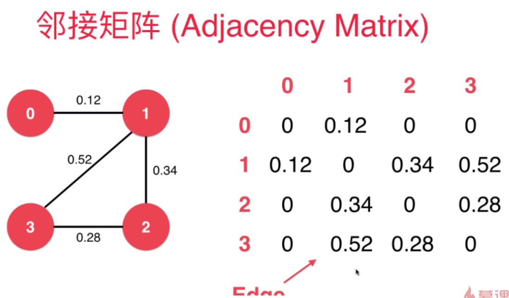
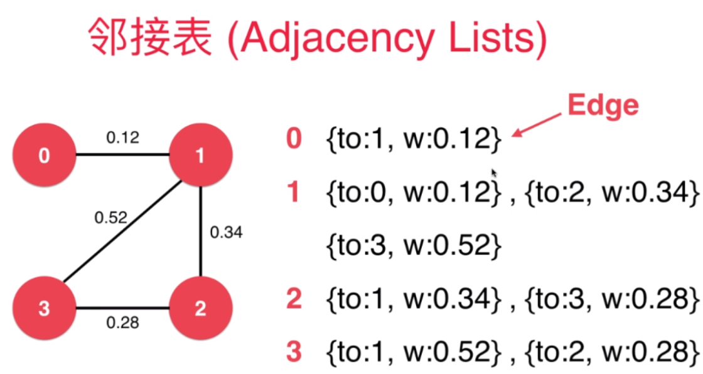

# 带权图

- 邻接矩阵来表示带权图

- 邻接表来表示带权图

# 最小生成树问题(Minimum Span Tree)

生成树:无环

连通的带权无向图的最小生成树:

- `v`的个顶点的`v-1`条边连接了`v`个顶点,且边的权值相加最小

应用
- 电缆布线设计
- 网络设计
- 电路设计

# 切分定理(Cut Property)

- 切分:把图中的节点分为两个部分
- 横切边:
  

切分定理
- 给定任意切分横切边中权值最小的边必然属于最小生成树
  
  - 证明略

通过一个点开始扩散.最终选出最小生成树

# Lazy Prim $O(ElogE)$[Todo]

> 根据点来选边,然后得到点

- 从`0`开始,分割为`{0}`和`{v-0}`两部分,选`0-7:0.16`最小权值的边
  - `{0}`
- 从剩下的边中找出权值最小的边`0-2:0.26`
  - `{0,7}`
- 从剩下的边中找出权值最小的边`0-2:0.26`
  - `{0,7,2}`
  - 后选边没有排除`{0,7,2}`形成的边,所以时`lazy`
- 从剩下的边中找出权值最小的边`7-1:0.19`
  - `{0,7,2,1}`
- 从剩下的边中找出权值最小的边`2-3:0.17`
  - `{0,7,2,1,3}`
- 从剩下的边中找出权值最小的边`7-5:0.28`
  - `{0,7,2,1,3,5}`
- 从剩下的边中找出权值最小的边`5-4:0.28`
  - `{0,7,2,1,3,5,7}`
- 最后加入`2-6:0.40`
  - `{0,7,2,1,3,5,7,6}`

选边没有排除`{0,7,2}`已有的边,所以是`lazy`

# Prime 优化 $O(Elogv)$[Todo]

- 不断更新与节点相连的最小的横切边
  - 使用`IndexminiHeap`记录最小生成树与未选的顶点的最小权值边,在加入新顶点(边)时,也要维护/更新`IndexminiHeap`

- 加入`{0}`

- 加入`{7}`,变为`{9,7}`

- ...

# Kruskal $O(ElogE)$[Todo]

> 选"最小"边,然后得到点

- 是不是每次选边时最短的边一定是最小生成树的边呢?

- 先根据边的权值对边进行排序

- 每次从未选择的边中选择一个不会形成环的最小的边
  - 使用`UnionFind`来判断环:如果加入边后,两个顶点属于同一个根,则形成环

# 其他问题

- 若有选择时有相等的最小边怎么办?
  - 最小生成树不止一个

Vyssotsky's Algorithm

- 一旦添加边,形成环,就删除权值最大的边
- 目前检测环没有很好的数据结构

