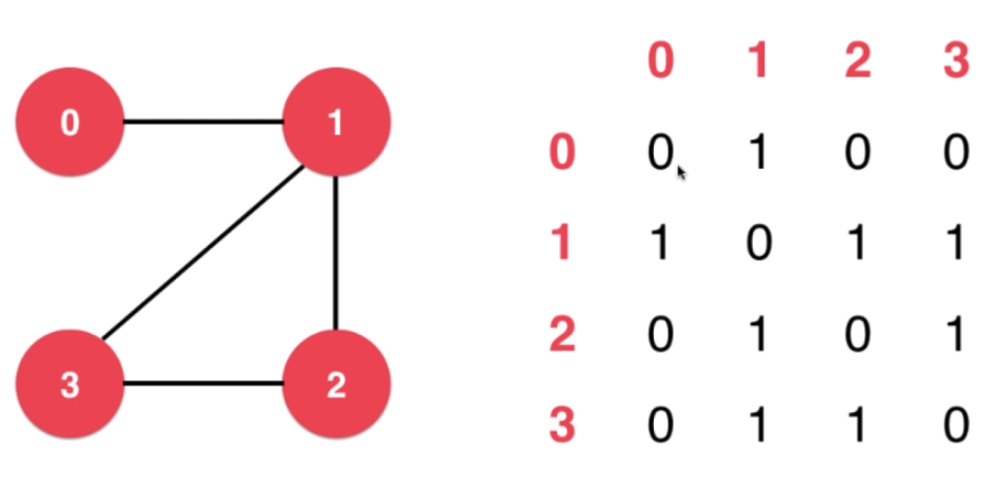
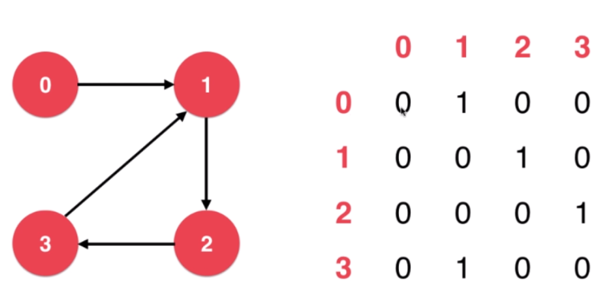
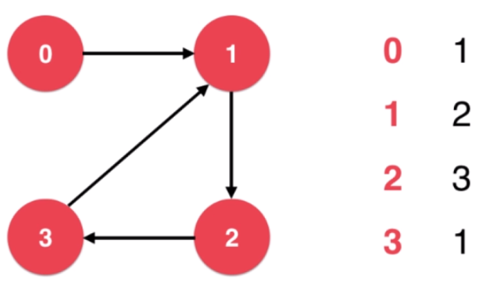
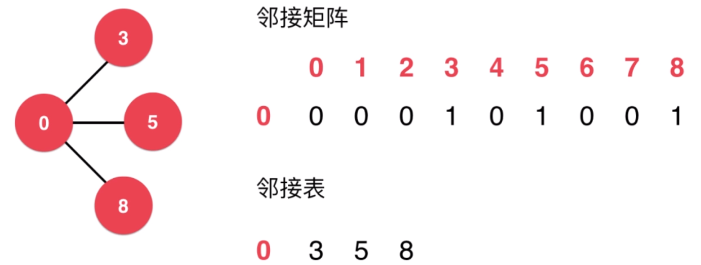
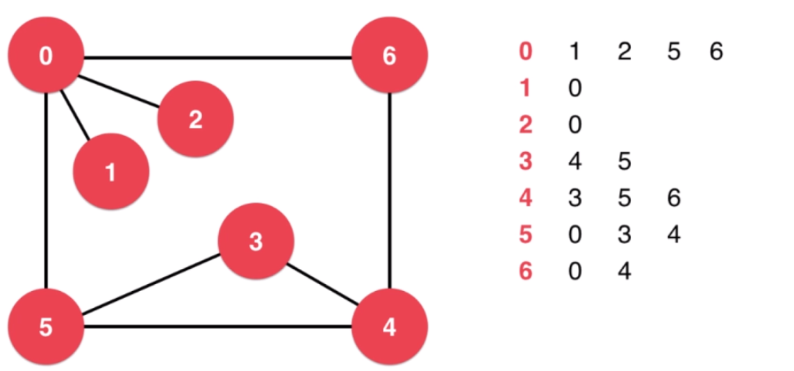
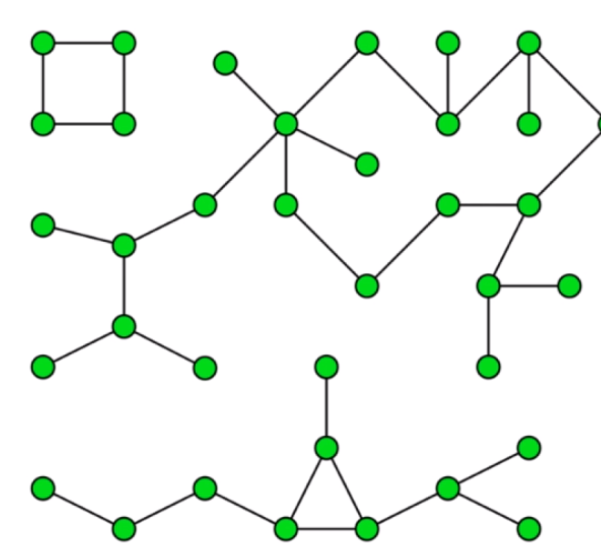

- 参考
  - 算法与数据结构 [C++ ] liubobobo

# Concept

- Vertex
- Edge

应用
- 交通运输
- 社交网络
- 互联网
- 工作安排
- 程序状态
  - 自动机

- Undirected Graph & Directed Graph

- Unweighted Graph & Weighted Graph

图的连通性

Simple Graph

- self-loop & parallel-edges
  - 不影响图的连通性

# 图的表示

## Adjacency matrix
- 无向图

- 有向图

- 邻接矩阵适合表示稠密图(Dense Graph)

## Adjacency List

- 邻接表适合用来表示稀疏图(Sparse Graph)
  - 每个顶点与其他顶点连接的边少于顶点总数

# 遍历顶点的临边

邻接矩阵`g[v][w]`
- `g[v][i]`,遍历行
邻接表
- `g[v]`,查表即可

> [详见](https://github.com/liuyubobobo/Play-with-Algorithms/tree/master/07-Graph-Basics/Course%20Code%20(C%2B%2B)/03-Vertex%20Adjacent%20Iterator)

## 读取本地文件/封装算法

# 图的遍历

> [200. Number of Islands](https://leetcode-cn.com/problems/number-of-islands/)

## 深度优先遍历
> 对比树的深度优先遍历,要记录每个顶点是否被遍历过

- 从`0`开始遍历,遍历到`1`
  - `0`
- 从`1`开始遍历,遍历到`0`,但是`0`已经被遍历了,且`1`没有相邻的顶点了,退回到`0`
  - `0,1`
- 从`0`开始遍历,遍历到`2`
- 从`2`开始遍历,遍历到`0`,但是`0`已经被遍历了,且`2`没有相邻的顶点了,退回到`0`
  - `0,1,2`
- 从`0`开始遍历,遍历到`5`
- 从`5`开始遍历,遍历到`0`,但是`0`已经被遍历了,遍历到`3`
  - `0,1,2,5`
- 从`3`开始遍历,遍历到`4`
  - `0,1,2,5,3`
- 从`4`开始遍历,遍历到`3`,但是`3,5`已经被遍历了,遍历到`6`
  - `0,1,2,5,3,4`
- 从`6`开始遍历,遍历到`0`,但是`0,4`已经被遍历了,退回到`4`
  - `0,1,2,5,3,4,6`
- 从`4`开始遍历,`3,5,6`均已被遍历过了,退回到`3`
- 从`3`开始遍历,`4,5`均已被遍历过了,退回到`5`
- 从`5`开始遍历,`0,4,5`均已被遍历过了,退回到`0`
- 从`0`开始遍历,`1,2,5,6`均已被遍历过了

### 连通分量

- 一个`图`是由几个小`图`构成的

> 未理解代码`Components.h`

### 获得两点之间的路径
- 深度优先搜寻并不能保证是无权图的最短路径
- 在遍历时存储路径

