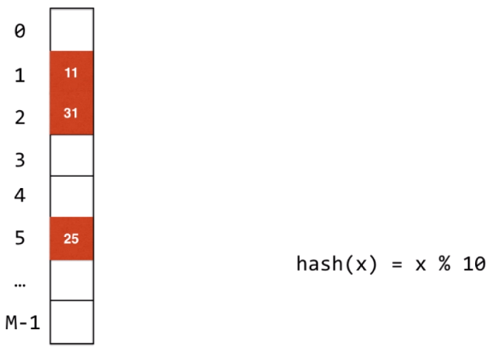

参考

- liuyubobobo

# 从[字符串中的第一个唯一字符](https://leetcode-cn.com/problems/first-unique-character-in-a-string/)开始

Given a string, find the first non-repeating character in it and return its index. If it doesn't exist, return -1.

**Examples:**

```
s = "leetcode"
return 0.

s = "loveleetcode"
return 2.
```

**Note:** You may assume the string contains only lowercase English letters.

使用数组

```C++
class Solution {
   public:
    int firstUniqChar(string s) {
        vector<int> ans(26, 0); // 创建一个长度为26的vector

        for (int i = 0; i < s.length(); i++) {
            // 对于字符`a`与`b`的ASCII相差1
            // s[i] - 'a'位置对应元素的值+1,即记录字符的重复度
            ans[s[i] - 'a'] += 1; 
        }

        for (int j = 0; j < s.length(); j++) {
            // 取出字符重复度为1的位置信息
            if (ans[s[j] - 'a'] == 1) {
                return j;
            }
        }

        return -1;
    }
};
```
# 哈希表
此处的数组就是一个`HashTable`

- 每个字符和一个索引相对应
- 哈希函数(杂凑函数,散列函数):将键值转化为索引
  - `f(ch) = ch - 'a'`


哈希冲突:
- 很难保证每一个键通过哈希函数的转换对应不同的索引


- 哈希表应用了算法设计的经典思想:用空间换时间
- "键"通过哈希函数得到的"索引"分布越均匀越好

# 哈希函数的设计

原则

- 一致性
- 高效性
- 均匀性

## 整型

小整型
- 小范围正整数直接使用
- 小范围负整数进行偏移
  - `-100~100`->`0~200`

大整数
- 取模:例如取后四位,即`num mod 10000`
- 缺点:取模可能会分布不均匀, 取模没有利用大整数的所有信息
- 解决方法:模一个素数


如何选取素数

- 依靠统计规律

## 浮点数

## 字符串

## 复合类型

# 解决哈希冲突的方法

## 链地址法(Separate Chaining)
哈希表


- `hashCode(k1) % M`
  - 结果可能为负数
- `(hashCode(k1) & 0x7ffffff) % M`
  - `0x7ffffff`:
    - 31个`1`
    - 最高位为`0`
    - 相与后忽略了符号位

对于哈希冲突的处理: 使用查找表(链表,红黑树等方式实现)


- 查找表可以用链表,红黑树等方式实现
  - 数据量小时用链表,当哈希冲突达到一定程度时红黑树更快

## 开放地址法

链地址法是封闭地址的,哈希表的索引只能只能包含通过哈希函数处理后为该索引的元素

开放地址法


线性探测法解决哈希冲突

- `31`和`11`,则`31`在`11`的下面找到第一个空位放入

-  `81`和`11`,则`81`在`11`的下面找到第一个空位放入


平方探查发解决哈希冲突

- 步长不是`1`,而是`1,4,9,16,...`

二次哈希法(再散列法)解决哈希冲突

- 当通过第一个散列函数 `Hash1(key)`得到的地址发生冲突时，则利用第二个散列函数 `Hash2(key)`计算该关键字的地址增量