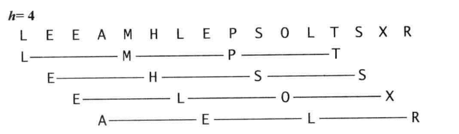

参考

- 算法 4th 2-1-6
- [希尔排序代码](https://www.bilibili.com/video/BV1mt4y1Q7d4)

# ShellSort

## 算法描述

希尔排序是一种基于[插入排序](InsertionSort.md)的快速的排序算法 。
对于大规模乱序数组插入排序很慢，因为它只会交换相邻的元素，因此元素只能一点一点地从数组的一端移动到另一端 。
例如，如果主键最小的元素正好在数组的尽头，要将它挪到正确的位置就需要$N- 1$次移动

希尔排序为了加快速度简单地改进了插入排序

- **交换不相邻的元素**以对数组的局部进行排序
- 并最终用插入排序将**局部有序**的数组排序 。  

希尔排序的思想

- 使数组中任意间隔为$h$的元素都是有序的。这样的数组被称为$h$有序数组
- 换句话说， 一个$h$有序数组就是$h$个互相独立的有序数组编织在一起组成的一个数组。
- 在进行排序时，如果$h$很大，我们就能将元素移动到很远的地方，为实现更小的$h$有序创造方便 。

用这种方式，对于任意以$1$结尾的$h$序列，我们都能够将数组排序 。 这就是希尔排序 。  

> =="对于任意以$1$结尾的$h$序列"中的1是什么意思?==

实现希尔排序的一种方法是对于每个$h$ , 用插入排序将$h$个子数组独立地排序。但因为子数组是相互独立的， 一个更简单的方法是在$h$－子数组中将每个元素交换到比它大的元素之前去（将比它大的元素向右移动一格） 。只需要在插入排序的代码中将移动元素的距离由$1$改为$h$即可。这样，希尔排序的实现就转化为了一个类似于插入排序但使用不同增量的过程。

## 算法分析

希尔排序更高效的原因是它权衡了子数组的规模和有序性。

- 排序之初，各个子数组都很短，排序之后子数组都是部分有序的，这两种情况都很适合插入排序。
- 数组部分有序的程度取决于递增序列的选择。

透彻理解希尔排序的性能至今仍然是一项挑战。

实际上，下面实现的算法是我们唯一无法准确描述其对于乱序的数组的性能特征的排序方法。

## 实现

如果我们在[插入排序](InsertionSort.md)中加入一个外循环来将$h$按照递增序列递减，我们就能得到这个简洁的希尔排序 。

增幅$h$的初始值是数组长度乘以一个常数因子，最小为 1 。

现使用了序列$\frac{1}{2}(3^k+1)$ ，从 $\frac{N}{3}$ 开始递减至 1 。我们把这个序列称为**递增序列** 。



下面代码实时计算了它的递增序列，另一种方式是将递增序列存储在一个数组中 。  

```C++
// ShellSort
// increasing order
class Solution {
public:
    vector<int> sortArray(vector<int>& nums){
        // {3x+1} increment sequence : 1, 4, 13, 40, 121, 364, 1093, ...
        // 即采用变化的h = {1, 4, 13, 40, 121, 364, 1093, ...}
		int h = 1;
        while(h < nums.size()/3){
            h = 3*h + 1;
        }

        while(h >= 1){ // 直到h递减至1
            // // h-sort the array
            for(auto i = h; i != nums.size(); i++){
                for(auto j = i; j >= h && nums[j] < nums[j-h]; j -= h)
                    swap(nums[j], nums[j-h]);
            }

            h = h/3; // 向下取整
        }

        return nums;
    }
};
```

> leetcode通过了,时间复杂度可见小于$O(n^2)$
>

## 实现2

先写插入排序

```C++
class Solution {
public:
    // InsertionSort
    // increasing order
    vector<int> sortArray(vector<int>& nums){
        // nums[0] 默认已排好序
        // i之前是排序好序的序列,i之后是未排序的序列
        for(auto i = 1; i != nums.size(); i++){ 
            // 将nums[i]插入nums[i-1],nums[i-2],...,nums[1]序列中
            // 通过交换,找num[j-1]<num[j]=nums[i]<num[j+1]的位置j;可能会不止一次的交换
            for(auto j = i; j != 0 && nums[j] < nums[j-1]; j--)
                swap(nums[j],nums[j-1]);
        }
    
         return nums;
    }
};
```

插入排序是相邻元素的比较`nums[j] < nums[j-1]`,是以`1`为间隔,现将比较间隔扩大

```C++
class Solution {
public:
    vector<int> sortArray(vector<int>& nums){
		for(auto h = nums.size()/2; h > 0; h = h/2) //  每次缩小间隔,直到相邻为止
        	for(auto i = h; i != nums.size(); i++){ 
                // 类比插入排序将nums[i]插入nums[i-1],nums[i-2],...,nums[1]序列中
                // 希尔排序将nums[i]插入nums[i-h],nums[i-2h],...序列中,h是变化的
        	    for(auto j = i; j >= h && nums[j] < nums[j-h]; j-=h)
        	        swap(nums[j],nums[j-h]);
        	}
    
         return nums;
    }
};
```

## 算法分析 续

如何选择递增序列呢？

要回答这个 问题并不简单 。算法的性能不仅取决于 h, 还取决于 h 之间的数学性质，比如它们的公因子等 。有很多论文研究了各种不同的递增序列 ，但都无法证明某个序列是“最好的＂。上述实现中递增序列的计算和使用都很简单，和复杂递增序列的性能接近 。 但可以证明复杂的序列在最坏情况下的性能要好于我们所使用的递增序列 。 更加优秀的递增序列有待我们去发现 。  

和选择排序以及插入排序形成对比的是 ， 希尔排序也可以用于大型数组 。 它对任意排序（不一定是随机的）的数组表现也很好 。 实际上，对于一个给定的递增序列，构造一个使希尔排序运行缓慢的数组并不容易
