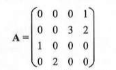

# 稀疏矩阵

三元组表示:

- 将非零元素及其相应的行和列构成一个三元组（行标，列标，值）  
- 稀疏矩阵压缩存储后便失去了随机存取特性。  

十字链表示:

- 矩阵的每一行用 一个带头结点的链表表示 , 每一列也用 一个带头结点的链表表示，
- 这种存储结构中的链表结点都有 5 个分量 ： 
  - 行分量
  - 列分量
  - 数据域分量
  - 指向下方结点的指针
  - 指向右方结点的指针  

