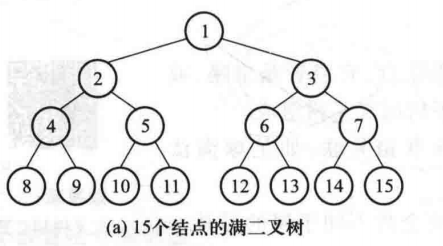
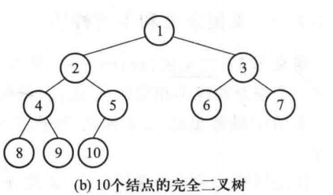

> 国内与国外存在定义的差别?

# Binary Tree

特点

- 节点的度最大为2
- 有序数
- 非空二叉树的第`i`层最多有$2^{i-1}$个节点
- 高度为`h`的二叉树最多有$2^h-1$个节点
- 对于任意一颗非空二叉树,如果叶子节点个数为$n_0$,度为`2`的节点个数为$n_2$,则有$n_0=n_2+1$
  - 边数:$n_1+2*n_2=(n_0+n_1+n_2)-1$
    - 度为1的节点数+2*度为2的节点数 = 除了根节点每个结点都有一条边
    - ""向下看,向上看""

# 真二叉树

- 所有节点的度为0或2

# 满二叉树



- 所有节点的度为0或2
- 所有叶子节点都在最后一层
- 高度为`h(h>=1)`的满二叉树
  - 第`i`层节点数量为$2^{i-1}$
    - 叶子节点数$2^{h-1}$
  - 总节点数$n=2^h-1$

# 完全二叉树



- 二叉树完全最后1层的叶子节点靠左对齐
> 对比满二叉树

性质
- 度为1的节点只有左子树
- 度为1的节点数量是0或1
- 同样节点数目的完全二叉树高度最低
- 高度为$h>=1$的完全二叉树的节点数`n`
  - 最少为$(2^{h-1}-1)+1 = 2^{h-1}$
  - 最多为$2^{h}-1$
  - $h-1<=log_2^n<h$,
    - $h = \left \lfloor log_2^n \right \rfloor + 1 $
- 对一个满二叉树进行从上到下,从左到右节点编号
  - 若$i>=1$,从1开始编号
  	- $i = 1$是根节点
  	- $i>1$的节点`i`的父节点为$\left \lfloor \frac{i}{2} \right \rfloor$
  	- $2i <= n$的节点$i$的左子节点为$2i$
  	- $2i>n$的节点$i$无左子节点
  	- $2i + 1 <= n$的节点$i$的右子节点为$2i + 1$
  	- $2i + 1>n$的节点$i$无右子节点
  - 若$i>=0$,从0开始编号
  	- $i = 0$是根节点
  	- $i>0$的节点`i`的父节点为$\left \lfloor \frac{i-1}{2} \right \rfloor$
  	- $2i + 1 <= n - 1$的节点$i$的左子节点为$2i$
  	- $2i + 1> n - 1$的节点$i$无左子节点
  	- $2i + 2 <= n - 1$的节点$i$的右子节点为$2i + 2$
  	- $2i + 2 > n - 1$的节点$i$无右子节点
> 二叉堆中会用到;不用背,用时现画
- 一颗完全二叉树有`n`个节点
  - $n = n_0 + n_1 + n_2$,又有$n_0 = n_2+1$
  > 注意下标表示度
  - 则$n = n_0+n_1+(n_0-1) = 2n_0+n_1-1$,且$n_1 = \{0,1\}$
  - 故当根据总结点数`n`的奇偶来判断叶子节点数,进而也可以得出非叶子节点数
    - 即$n_0 = \left \lfloor \frac{n+1}{2} \right \rfloor$
    ```C++
    // n0 = (n+1) / 2;//默认向下取整
    n0 = (n+1) >> 1;
    ```