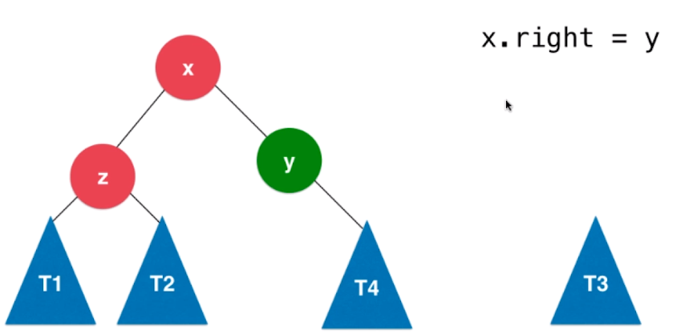

- 对`x`进行左旋转对于`BST`来说,插入顺序序列的化,`BST`会退化为链表

# AVL
`AVL`:G. M. Adelson-Velsky , E. M. Landis 1962年

`AVL`特点:自平衡

平衡二叉树举例
- 满二叉树
- 线段树
- ...

定义:对于任意一个节点,左右子树的高度差不能超过`1`

平衡二叉树的高度和节点数量之间的关系是$O(logn)$

> 证明待补

标注节点的高度

平衡因子:左子树的高度-右子树的高度

# 旋转操作的基本原理

什么时候维护平衡?
- 在二分搜索树中插入节点,从根节点向下找到满足条件的叶子节点.因为其父亲,或祖先节点的平衡因子改变, 这个步骤可能会破坏平衡性

- `Ti`:表示子树或空节点
- 平衡因子
  - `y` = `H(x) - H(T4) > 1`
  - `x` = `H(z) - H(T3) >= 0`
  - `z` = `H(T1) - H(T2) >= 0`
- 根据二分搜索树的特性:`左 < 中 < 右`
  - `T1 < z < T2 < x < T3 < y < T4`

# `LL`:右旋转

- 操作降低`y`的左子树的高度,使其降低平衡因子,同时又保持二分搜索树的性质
- 将以`y`为节点的右子树替换`x`的右子树`T3`

- 然后,将`T3`作为`y`的左子树

**右旋转完毕**

- 以`x`为轴心向右顺时针旋转`y`

证明右旋转后仍然是平衡二叉树

- 右旋转前/在`y`左子树插入节点后
  - `x`,`z`平衡,`y`不平衡
  - 以`z`为根的二叉树的高度`h+1 `
    - `h(z) = max{h(T1), h(T2)}`
  - `x`的平衡因子`{0, 1}`
    - `h(T3) = h(z) - {0, 1} = {h+1, h}`
  - 在`y`左子树插入节点后,`y`不平衡了,平衡因子为`1+1 = 2`
    - `h(T4) = h(x) -  2 = h`

- 右旋转后
  - `z`,`x`的树高未变化
  - `y`:
    - 平衡因子 = `h(T3) - h(T4) = {1, 0}`
    - `h(y) = max{h(T3), h(T4)} + 1 = {h + 1, h}`

# `RR:`左旋转

在`y`的右子树插入新结点后,平衡因子大于`1`

# `LR左旋转到LL,然后右旋转`

- 对`x`进行左旋转

## `RL右旋转到RR,然后左旋转`

- 对`x`进行右旋转

# AVL中删除元素

- 删除该节点后,向上搜索维护祖先节点的平衡性