参考

- 恋上数据结构与算法 小码哥
- 算法与数据结构 liuyubobobo

# Tree

## 基本概念

树

- 有根树
- 无根树,自由树


节点

- 根节点(`root`)
- 父节点(`father`)
- 子节点(`child`)
- 兄弟节点(`sibling`)
- 叶子结点(`leaf`)
  - 无子节点的节点


子树

- 左子树
- 右子树


度

- 节点的度:子树的个数
- 树的度:所有节点的度的最大值


==树的总结点数 = 边数(度) + 1==


层数

- 根节点是第`0`层或第`1`层


深度(`depth`):从根节点到节点的路径长度


高度(`height`):从节点到叶子结点的路径长度

- 树的高度即为根的高度


有序数

无序树

森林


# Binary Tree

> 国内与国外存在定义的差别?

特点

- 节点的度最大为2
- 有序数
- 非空二叉树的第`i`层最多有$2^{i-1}$个节点
- 高度为`h`的二叉树最多有$2^h-1$个节点
- 对于任意一颗非空二叉树,如果叶子节点个数为$n_0$,度为`2`的节点个数为$n_2$,则有$n_0=n_2+1$
  - 边数:$n_1+2*n_2=(n_0+n_1+n_2)-1$
    - 度为1的节点数+2*度为2的节点数 = 除了根节点每个结点都有一条边
    - ""向下看,向上看""

## 真二叉树

- 所有节点的度为0或2

## 满二叉树

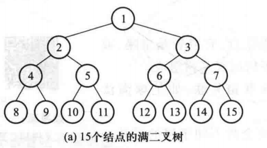

- 所有节点的度为0或2
- 所有叶子节点都在最后一层
- 高度为`h(h>=1)`的满二叉树
  - 第`i`层节点数量为$2^{i-1}$
    - 叶子节点数$2^{h-1}$
  - 总节点数$n=2^h-1$

## 完全二叉树

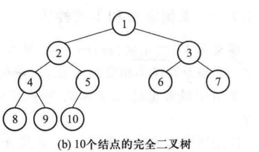

- 二叉树完全最后1层的叶子节点靠左对齐
> 对比满二叉树

性质
- 度为1的节点只有左子树
- 度为1的节点数量是0或1
- 同样节点数目的完全二叉树高度最低
- 高度为$h>=1$的完全二叉树的节点数`n`
  - `n`最少为$(2^{h-1}-1)+1 = 2^{h-1}$
  - `n`最多为$2^{h}-1$
  - $h-1<=log_2^n<h$,
    - $h = \left \lfloor log_2^n \right \rfloor + 1 $
- 对一个满二叉树进行从上到下,从左到右节点编号
  - 若$i>=1$, 从`1`开始编号
  	- $i = 1$是根节点
  	- $i>1$的节点`i`的父节点为$\left \lfloor \frac{i}{2} \right \rfloor$
  	- $2i <= n$, 节点$i$的左子节点为$2i$
  	- $2i>n$, 节点$i$==无左子节点==
  	- $2i + 1 <= n$, 节点$i$的右子节点为$2i + 1$
  	- $2i + 1>n$, 节点$i$==无右子节点==
  - 若$i>=0$,从0开始编号
  	- $i = 0$是根节点
  	- $i>0$的节点`i`的父节点为$\left \lfloor \frac{i-1}{2} \right \rfloor$
  	- $2i + 1 <= n - 1$的节点$i$的左子节点为$2i$
  	- $2i + 1> n - 1$的节点$i$无左子节点
  	- $2i + 2 <= n - 1$的节点$i$的右子节点为$2i + 2$
  	- $2i + 2 > n - 1$的节点$i$无右子节点
> 二叉堆中会用到;不用背,用时现画
- 一颗完全二叉树有`n`个节点
  - $n = n_0 + n_1 + n_2$,又有$n_0 = n_2+1$
  > 注意下标表示度
  - 则$n = n_0+n_1+(n_0-1) = 2n_0+n_1-1$,且$n_1 = \{0,1\}$
  - 故当根据总结点数`n`的奇偶来判断叶子节点数,进而也可以得出非叶子节点数
    - 即$n_0 = \left \lfloor \frac{n+1}{2} \right \rfloor$
    ```C++
    // n0 = (n+1) / 2;//默认向下取整
    n0 = (n+1) >> 1;
    ```

# 思考一个问题

一个基础/常用的问题

- 如何在`n`个整数中搜索一个整数?
- 字典
  - 键值对(`k-v`)

>  涉及添加,删除,搜索操作

- 对于数组
  - 无序数组
    - $O(n)$
  - 有序数组
    - 二分查找法(1946年提出,1962年才正确实现),$O(logn)$
- 对于二叉搜索树
  - 时间复杂度$O(logn)$

二分搜索树比数组更好地提供了查询数据之间关系的问题的工具

- min,max
- floor,ceil
- rank:当前数据的名次`i`
- select:查询第`i`名的元素是什么

# Binary Search(BS)

> 设计对已排序序列的处理都可以套用BS,[详见](..\Exercises\Binary Search)

```C++
template<typename T>
vector<T> binarySearch(vector<T> &arr, T target);

template<typename T>
bool binarySearch(vector<T> arr, T target){
    T l = 0,r = arr.size() - 1; // arr[l:r]
    while(l <= r){ // 注意边界的判断
        // T mid = (l+r)/2; // 可能产生int的溢出
        T mid = l + (r-l)/2;
        if(arr[mid] == mid)
            return true;
        if(arr[mid] < mid){ 
            r = mid - 1; // 注意边界的判断
        }else{
            l = mid + 1;
    }
     
    return false;
}
```

```C++
template<typename T>
vector<T> binarySearch(vector<T> &arr, T target);

template<typename T>
bool binarySearch(vector<T> arr, T target){
    T l = 0,r = arr.size(); // arr[l:r)
    while(l < r){ // 注意边界的判断
        // T mid = (l+r)/2; // 可能产生int的溢出
        T mid = l + (r-l)/2;
        if(arr[mid] == mid)
            return true;
        if(arr[mid] < mid){ 
            r = mid + 1; // 注意边界的判断
        }else{
            l = mid;
    }
     
    return false;
}
```

> 注意搜索区间的开闭,从而是否加1,条件判断是否加等号

递归实现

```C++

int recurse(vector<int>& nums, int low, int high, int target) {
    if (low <= high) {
        int mid = (low + high) / 2;
        if (nums[mid] == target) 
            return mid;
        else if (target > nums[mid]) 
            return recurse(nums, mid + 1, high, target);
        else 
            return recurse(nums, low, mid - 1, target);
    }
    else return -1;
}

int search(vector<int>& nums, int target) {
    return recurse(nums, 0, nums.size() - 1, target);
}
```

> 理解递归思维,寻找子问题

## 关于`floor`和`ceil`(或`lowerbound`和`higherbound`)

查找元素

- `floor`:第一次出现的位置
- `ceil`:最后出现的位置

[详见](https://github.com/liuyubobobo/Play-with-Algorithms/tree/master/05-Binary-Search-Tree/Course%20Code%20(C%2B%2B)/Optional-02-Floor-and-Ceil-in-Binary-Search)

# Binary Search Tree(BST)

> 二叉搜索树 = 二叉排序树 = 二叉查找树

特点

- 左子树的键值 < 节点的键值 < 右子树的键值​
- 子树也满足BST
  - 递归定义
- 存储的元素要具有可比较性,不允许为`NULL`
  - 对于自定义类型,要指定比较方式

> 二分搜索树不一定是一颗完全二叉树;堆一定是完全二叉树,所以堆可以用数组来表示

## Insert

> [701. Insert into a Binary Search Tree](https://leetcode-cn.com/problems/insert-into-a-binary-search-tree/)

如何插入一个新节点

- 与根`key`比较
  - 大:右子树
  - 小:左子树
- 递归此过程
  - 为空,直接插入
  - 不为空,"覆盖"

```C++
// Recursion
Node* insertRecursive(Node*& node, Key key, Value value) {
    if (node == nullptr) {  // base
        count++;
        return new Node(key, value);
    }

    if (key == node->key)
        node->value = value;  // update value
    else if (key < node->key)
        node->left = insert(node->left, key, value);
    else
        node->right = insert(node->right, key, value);

    return node;
}
```

```C++
// 用两个指针记录父节点和子节点,迭代匹配,找到后插入父节点
// Iterative function to insert a key into BST.
// Root is passed by reference to the function
Node* insertIterative(Node*& node, Key key, Value value) {
    // start with root node
    Node* curr = root;

    // pointer to store parent node of current node
    Node* parent = nullptr;

    // if tree is empty, create a new node and set root
    if (root == nullptr) {
        count++;
        return root = new Node(key, value);
    }

    // traverse the tree and find parent node of key
    while (curr != nullptr) {
        // update parent node as current node
        parent = curr;

        // if given key is less than the current node, go to left subtree
        // else go to right subtree
        if (key < curr->key)
            curr = curr->left;
        else
            curr = curr->right;
    }

    // construct a new node and assign to appropriate parent pointer
    if (key == node->key) {
        parent->value = value;
    } else if (key < parent->key) {
        parent->left = new Node(key, value);
    } else {
        parent->right = new Node(key, value);
    }

    return root;
}
```

## Contains/Search

> [04-Binary-Search-Tree-Search](https://github.com/liuyubobobo/Play-with-Algorithms/tree/master/05-Binary-Search-Tree/Course%20Code%20(C%2B%2B)/04-Binary-Search-Tree-Search)
>
> - CLion编译不通过
> - VSCode可以编译

- 递归实现与Insert类似

```C++
bool contain(const Node*& node, Key key) const {
    if (node == nullptr)  // base
        return false;

    if (key == node->key)
        return ture;
    else if (key < node->key)
        contain(node->left, key);
    else
        contain(node->right, key);
}

Value* search(const Node*& node, Key key) const {
    if (node == nullptr) {  // base
        return nullptr;
    }
    if (key == node->key)
        return &(node->value);
    else if (key < node->key)
        return search(node->left, key, value);
    else
        return search(node->right, key, value);
}
```

二分搜索与顺序搜索的比较

```shell
There are totally 431180 words in bible.txt

'god' : 2301
BST , time: 1.019 s.

'god' : 2301
SST , time: 20.864 s.
```

## Traverse

- 前序(先根)遍历:根->左->右
- 中序(中根)遍历:左->根->右
  - 输出结果是从小到大排列(这是由二分搜索树定义决定的性质)
- 后序(后根)遍历:左->右->根

### Recursive

```C++
void preOrder(Node* node) {
    if (node != nullptr) {
        cout << node->key << "\n";
        preOrder(node->left);
        preOrder(node->right);
    }
}

void inOrder(Node* node) {
    if (node != nullptr) {
        inOrder(node->left);
        cout << node->key << "\n";
        inOrder(node->right);
    }
}

void postOrder(Node* node) {
    if (node != nullptr) {
        inOrder(node->left);
        inOrder(node->right);
        cout << node->key << "\n";
    }
}
```

### Not Recursive

## Traverse Level

层次遍历
- DFS
  - 递归实现
    - 用二维数组实现, 见[代码](..\Exercises\Binary Tree Level Order Traversal)
      - 需要记录深度(层数)
- 非递归实现
  
- BFS
  - 用两个vector(其中存储的是节点信息)实现, 见[代码](..\Exercises\Binary Tree Level Order Traversal)
  - 用队列实现

### DFS

### BFS

- 节点"入队"
- "出队"节点,然后将其左右孩子入队
- 重复此过程

#### vector

#### Queue

## 删除最小值和最大值

### 先找到最小值和最大值

- 最小值
  - 最左边的节点,
  - 一直循环/递归找找左孩子,直到为空
- 最大值
  - 最右边的节点
  - 一直循环/递归找找右孩子,直到为空

```C++
Node *minimum(Node *node) {
  if (node->left == nullptr)
    return node;

  return minimum(node->left);
}
```

```C++
Node *minimum(const Node* &node) const {
  Node *cur, pre;
  pre = node;
  cur = pre->left while (!cur->left) {
    cur = cur->left;
    pre = cur;
  }

  return cur;
}
```

### 删除最小值和最大值

删除最小值
- 叶子节点
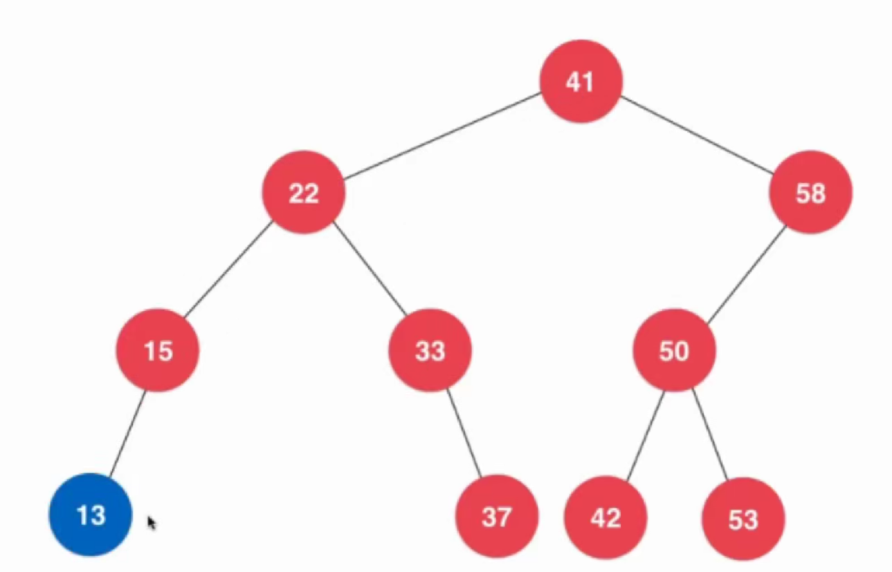

- 非叶子节点
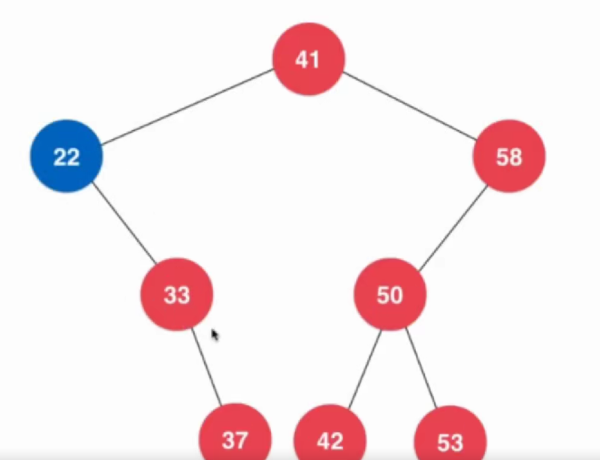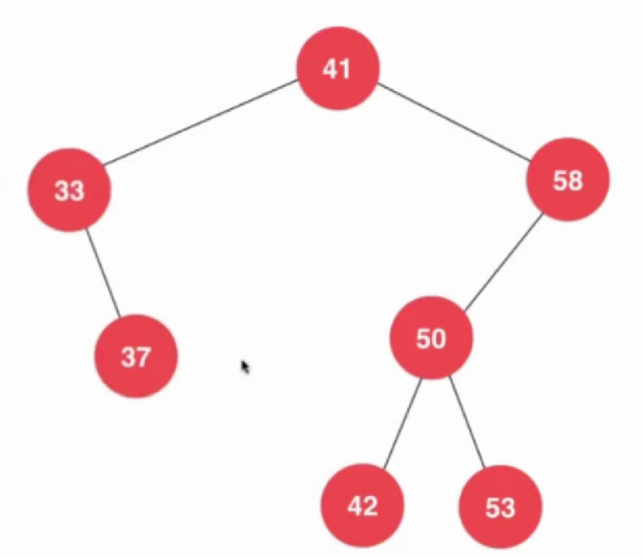

```C++
Node *removeMin(Node *node) {
  if (node->left == nullptr) {
    // 包含了node是叶子节点和不是叶子节点两种情况:
    // 叶子节点返回空(叶子节点的右儿子也为空);非叶子节点,返回右儿子
    Node *rightNode = node->right;
    delete node;
    count--;
    return rightNode;
  }

  node->left = removeMin(node->left);
  return node;
}
```


删除最大值

- 叶子节点
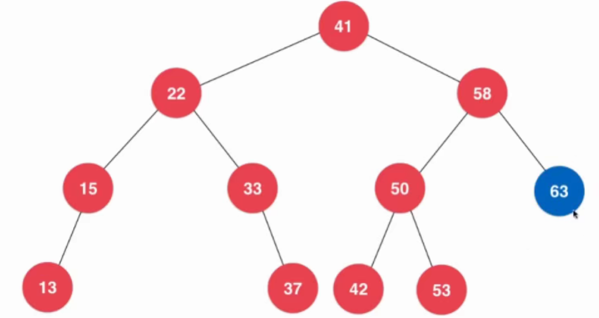

- 非叶子节点
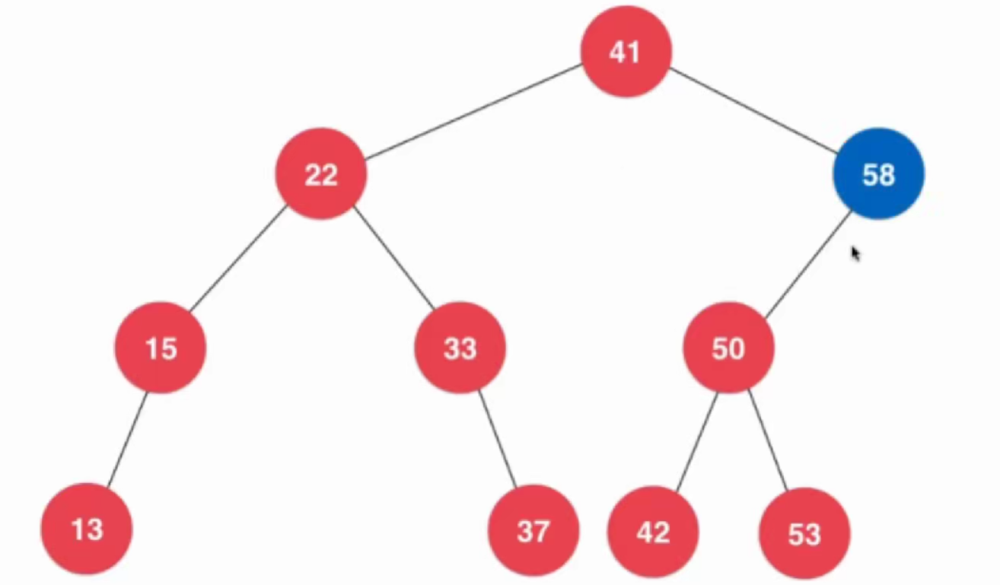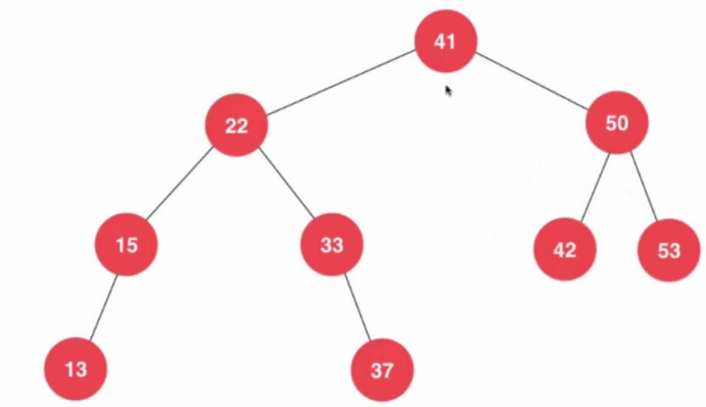

## 删除任意节点*

对比删除最小值节点和删除最大值节点

- 最小值节点只有右孩子;最大值节点只有左孩子

### 对于只有(左或右)一个孩子的节点的情形

- 删除只有右孩子的节点方法同删除最小值节点的方法
- 删除只有左孩子的节点方法同删除最大值节点的方法

### 删除有左右两个孩子的节点的情形
> 1962 - Hubbard Deletion 

以下图的节点`58`举例


- 删除`58`与根节点`41`的左孩子无关,因为`41`的右子树必然大于左子树
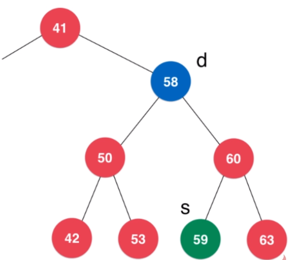

哪个节点顶替`58`的位置呢?
- 该节点要满足大于`58`的左孩子,同时又小于`58`的右孩子

- 满足条件的节点:
  

  
#### 用`58`右子树的最小值来顶替`58`,例子中是`59`

- 这样就回到了删除一个节点最小值的问题了:
  
  - `s = min(d->right)`
  
- 将删除了最小值的后的`58`的右子树连接到`s`的右子树上:
  
- `s->right = deMin(d->right)`:
  
- 将`58`的左子树连接到`s`的左子树上:
  - `s->left = d ->left`
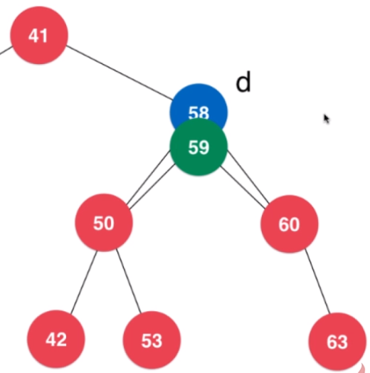

- 删除`d`,`s`是新子树的根,然后返回`s`

```C++
struct Node {
  Key key;
  Value value;
  Node *left;
  Node *right;

  Node(Key key, Value value) {
    this->key = key;
    this->value = value;
    this->left = this->right = NULL;
  }

  // 拷贝赋值构造
  Node(Node *node) {
    this->key = node->key;
    this->value = node->value;
    this->left = node->left;
    this->right = node->right;
  }
};

Node *remove(Node *node, Key key) {
  if (node == nullptr)
    return nullptr;

  if (key == node->key) {
    if (node->left == nullptr) { // min
      Node *rightNode = node->right;
      delete node;
      count--;
      return rightNode;
    }

    if (node->right == nullptr) { // max
      Node *leftNode = node->left;
      delete node;
      count--;
      return leftNode;
    }

    // 关键部分
    Node *successor = minimum(node->right); // 指向node右子树的最小值
    count++;

    // successor->right = removeMin(node->right),
    // 若直接这么用有问题removeMin(node->right)后,node->right的值变为未定义/空
    successor->right = new Node(removeMin(node->right));
    successor->right = node->left;

    // 关键部分

    delete node;
    count--;

    return successor;
  } else if (key < node->key) {
    node->left = remove(node->left, key);
    return node;
  } else {
    node->right = remove(node->right, key);
    return node;
  }
}
```

#### 用`58`左子树的最大值来顶替`58`,例子中是`53`

过程类似如上
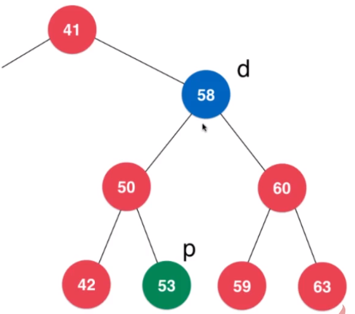

## 二分搜索树的顺序性[Todo]

- 最小元素和最大元素
- 前驱和后继
- `floor`,`ceil`
  - 若找不到`Key`:
    - `floor->key < Key < ceil->key`
    - 也可能没有`floor`,或`ceil`
  - 若找到`key`:
    - `floor=ceil=node`
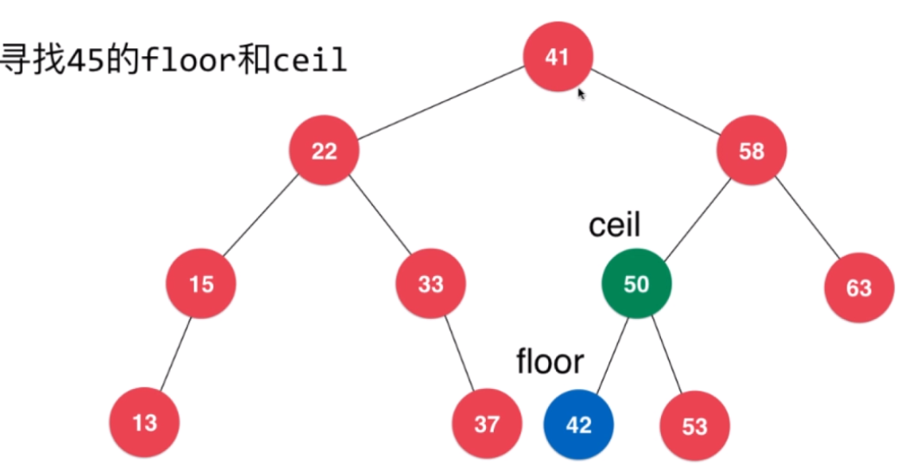
- `rank`,`select`
  - `rank`:某个键值排第几
  - `select`:排名第几的元素是什么
  - 对节点加入新的域,表示以该节点为根的树的节点总数
- 支持重复元素的二分搜索树
  - 对节点加入新的域,表示重复节点的个数

## 局限性

- 同样的数据可对应不同的二分搜索树
- 二分搜索树可能退化成链表
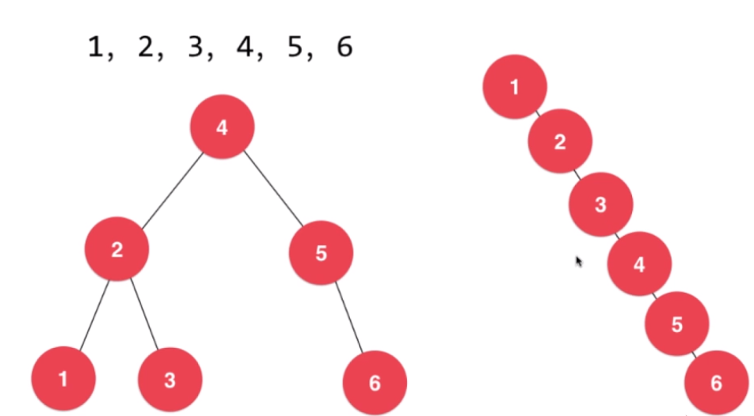

### 改进:使用平衡二叉树

- 左右子树的高度差不超过`1`,从而保证树高为$O(logn)$
- 平衡二叉树的实现
  - 红黑树
  - 2-3 Tree
  - AVL树
  - 伸展树(Splay tree)

# `Treap` (Tree + Heap)

### `Trie`

$O(length(key))$

词频统计

# Tree-Like Problem

递归法天然的树形性质

- 归并排序
- 快速排序
- 搜索问题
  - 8皇后
  - 数独
  - 围棋
  - "搬运工"游戏

