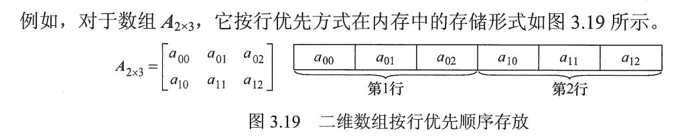
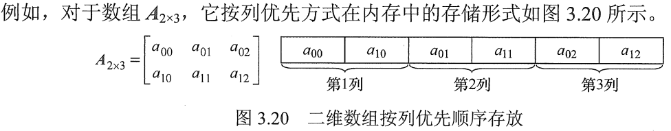

# 高维数组的存放顺序

设二维数组的行下标与列下标的范围分别为 $[0, h_1]$与 $[0, h_2]$ 

按行优先顺序

- 先行后列，先存储行号较小的元素，行号相等先存储列号较小的元素  
- 当以行优先方式存储时,得出存储结构关系式为 :$LOC(a_{i,j}) = LOC(a_{0,0}+[i \times(h_2＋ 1)+j] \times L$

按列优先顺序 

- 当以列优先方式存储时,得出存储结构关系式为:$LOC(a_{i,j}) = LOC(a_{0,0}+[j \times(h_1＋ 1)+i] \times L$

